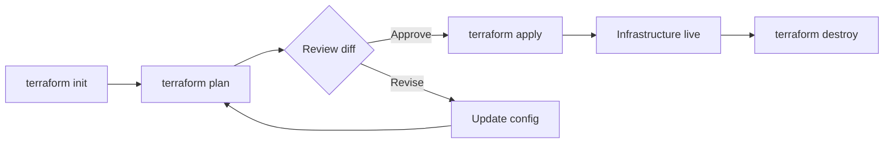
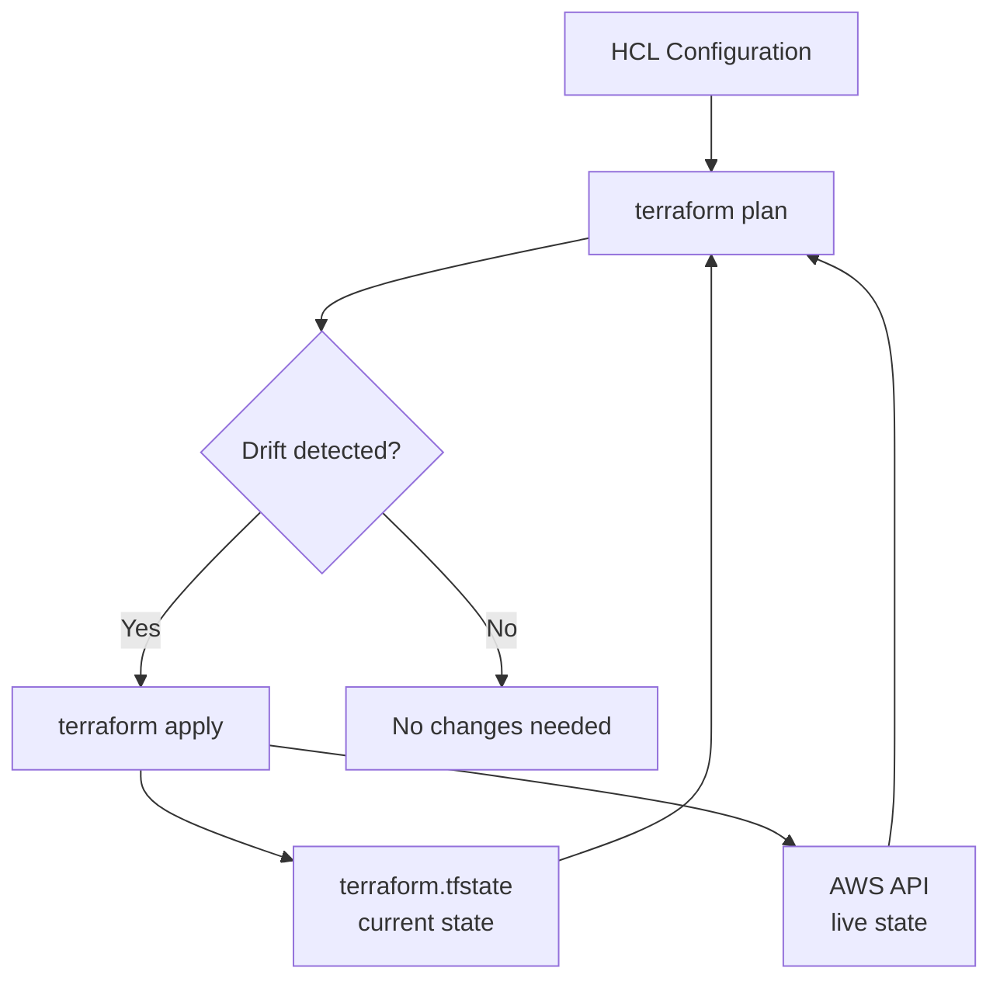
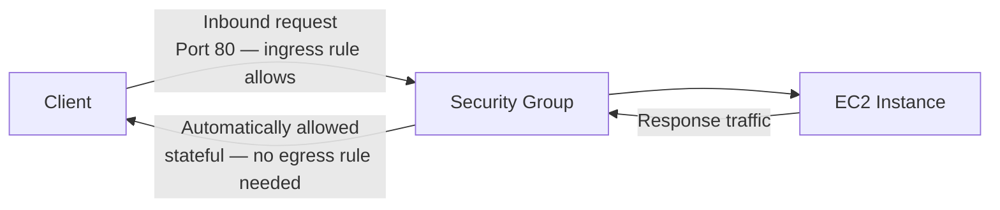
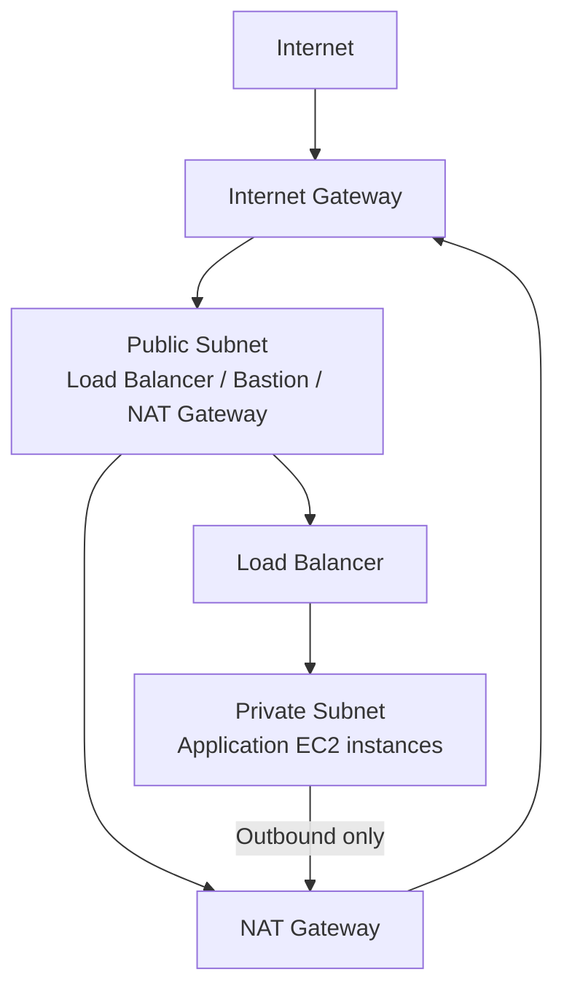
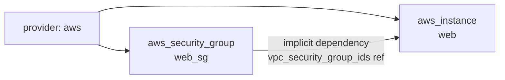
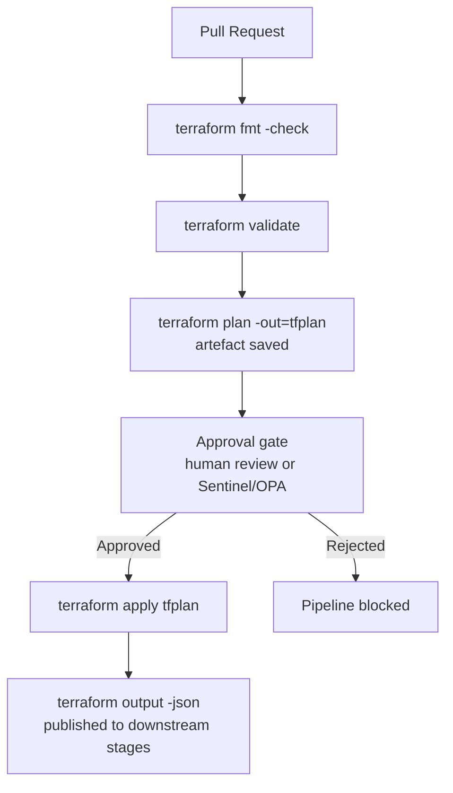

# Interview Questions — EC2 Terraform Instance

DevOps-level interview questions covering the concepts demonstrated in this project. Questions are grouped by topic and progress from foundational to advanced.

---

## Terraform Core Concepts

**Q1. What is the purpose of `terraform init` and what does it do under the hood?**

`terraform init` initialises the working directory by downloading provider plugins defined in `versions.tf`, setting up the backend, and creating the `.terraform.lock.hcl` file. It must be run before any other Terraform command. The lock file pins exact provider binary checksums so that every subsequent `init` on any machine installs the identical provider version.

---

**Q2. What is the difference between `terraform plan` and `terraform apply`?**

`terraform plan` performs a dry run — it reads current state and queries the AWS API to compute what changes would be made, but makes no modifications. `terraform apply` executes those changes. Running `plan -out=tfplan` followed by `apply tfplan` guarantees that exactly what was reviewed gets applied, which is critical in CI/CD pipelines.



---

**Q3. What does `~> 5.0` mean in the AWS provider version constraint?**

The `~>` (pessimistic constraint) operator allows only patch and minor version upgrades within the specified minor version. `~> 5.0` permits `5.0.x`, `5.1.x`, `5.99.x`, but not `6.0.0`. This prevents breaking changes from a major version bump while still receiving bug fixes automatically.

---

**Q4. What is the `.terraform.lock.hcl` file and should it be committed to version control?**

It records the exact provider versions and SHA-256 checksums selected by `terraform init`. **Yes, it should be committed.** Committing it ensures all developers and CI pipelines use the identical provider binary, preventing "works on my machine" issues caused by provider version drift.

---

**Q5. What is Terraform state and why is it important?**

Terraform state (`terraform.tfstate`) maps your configuration resources to real-world infrastructure. Terraform uses it to determine what exists, what needs to change, and what should be destroyed. Without state, Terraform cannot track drift or perform incremental updates — it would attempt to recreate all resources on every apply.



---

**Q6. Why is it recommended to use a remote backend for Terraform state in a team environment?**

A local state file cannot be shared, provides no locking (allowing two engineers to apply simultaneously and corrupt state), and is lost if the machine is destroyed. A remote backend — such as S3 + DynamoDB — solves all three: state is centralised, DynamoDB provides distributed locking, and S3 provides durability and versioning for the state file itself.

---

**Q7. What is `terraform destroy` used for?**

`terraform destroy` tears down all resources managed by the configuration. It generates a destruction plan and requires confirmation before proceeding. Used to clean up temporary or demo environments and avoid ongoing cloud costs. In production, access to `destroy` is typically restricted via IAM or pipeline controls.

---

**Q8. What is `terraform output` used for?**

It reads and displays the values declared in `outputs.tf` from the current state file. Outputs allow downstream Terraform modules, CI/CD pipelines, or application configuration scripts to consume infrastructure values (such as an instance ID or public IP) without hard-coding them.

---

## EC2 Instance Fundamentals

**Q9. What is an Amazon Machine Image (AMI) and what does it contain?**

An AMI is a pre-configured template used to launch EC2 instances. It contains the root volume snapshot (OS and pre-installed software), launch permissions (which AWS accounts can use it), and block device mappings that define the storage configuration. AMIs are region-specific — the same AMI ID does not exist in another region and must be re-identified or re-copied if deploying cross-region.

---

**Q10. Why is the AMI hardcoded instead of using a data source?**

Predictability. A hardcoded AMI is always the same regardless of when `terraform apply` is run. A `data "aws_ami"` lookup using `most_recent = true` could resolve to a different AMI version on a future run — for example, if Amazon publishes a new Ubuntu 22.04 patch — causing unexpected instance replacement. The trade-off is that the AMI ID is `us-east-1`-specific and must be updated manually when rotating OS versions. For production, the recommended approach is a pinned `data` source filtered to a specific patch release name:

```hcl
data "aws_ami" "ubuntu" {
  most_recent = false
  filter {
    name   = "name"
    values = ["ubuntu/images/hvm-ssd/ubuntu-jammy-22.04-amd64-server-20240301"]
  }
  owners = ["099720109477"]
}
```

---

**Q11. What is the difference between stopping and terminating an EC2 instance?**

| Action | Root Volume | Instance Store | Public IP | Billing |
|--------|------------|----------------|-----------|---------|
| Stop | Retained | Lost | Released (unless Elastic IP) | No instance charge; EBS still billed |
| Terminate | Deleted (if `DeleteOnTermination=true`) | Lost | Released | No charges after termination |

A stopped instance retains its private IP and can be restarted. A terminated instance is irreversibly destroyed.

---

**Q12. What is the `instance_type` attribute and how does it affect cost and performance?**

The instance type defines the virtual hardware profile — vCPU count, memory, network bandwidth, and storage throughput. `t2.micro` (1 vCPU, 1 GB RAM) is the Free Tier-eligible choice suited for demos. In production, instance type selection is driven by workload profiling:

| Family | Examples | Optimised for |
|--------|----------|---------------|
| General purpose | t3, m6i | Balanced compute/memory — web servers, small DBs |
| Compute optimised | c6i | CPU-intensive — batch processing, gaming servers |
| Memory optimised | r6i | Large in-memory datasets — caching, analytics |
| Storage optimised | i3en, im4gn | High IOPS — Kafka, Cassandra, OLTP databases |

---

**Q13. What is `user_data` in an EC2 Terraform resource and when is it executed?**

`user_data` is a shell script (or cloud-init configuration) that runs once at first boot, before the instance is accessible. It is passed as base64-encoded text to the EC2 launch API. Common uses include installing packages, configuring services, pulling application code, or registering the instance with a configuration management system. Terraform does not re-run `user_data` on subsequent applies unless the script content changes, which would trigger instance replacement.

---

**Q14. What is an Elastic IP address and when would you use one?**

An Elastic IP (EIP) is a static public IPv4 address that you allocate to your AWS account and associate with an EC2 instance. By default, EC2 instances receive a dynamic public IP that changes on stop/start. An EIP persists across stop/start cycles, making it suitable for services that require a stable DNS-resolved endpoint — for example, a VPN gateway or a legacy application with IP whitelisting. Note: an unattached EIP incurs an hourly charge to discourage hoarding of IPv4 addresses.

---

## Security Groups and Networking

**Q15. Why is the security group defined as a separate resource rather than an inline block?**

Security groups are standalone AWS resources and can be shared across multiple instances. Defining it separately follows the single-responsibility principle and makes `vpc_security_group_ids` a clean reference rather than an inline block. It also allows the security group to be managed independently — updated, shared, or reused — without touching the EC2 resource definition. Inline security group blocks inside `aws_instance` cannot be referenced by other resources.

---

**Q16. What is the difference between a security group and a Network ACL (NACL)?**

| Feature | Security Group | NACL |
|---------|---------------|------|
| Scope | Instance-level (ENI) | Subnet-level |
| Statefulness | Stateful — return traffic automatically allowed | Stateless — return traffic requires explicit allow rule |
| Rule evaluation | All rules evaluated; most permissive wins | Rules evaluated in numeric order; first match wins |
| Default behaviour | Deny all inbound, allow all outbound | Allow all inbound and outbound |
| Use case | Primary instance firewall | Additional subnet-level boundary control |

For most workloads, security groups alone are sufficient. NACLs are used as a secondary defence layer in high-security or compliance-driven environments.

---

**Q17. How would you restrict SSH access to a known IP instead of `0.0.0.0/0`?**

Replace `cidr_blocks = ["0.0.0.0/0"]` in the ingress block with `cidr_blocks = ["<your-ip>/32"]`. The `/32` prefix denotes exactly one IPv4 address. In a team environment, use a CIDR block for your office's static IP range. In a production environment, consider removing SSH entirely and using AWS Systems Manager Session Manager, which provides authenticated shell access without requiring port 22 or a key pair.

---

**Q18. What are ingress and egress rules in a security group, and how does statefulness work?**

- **Ingress rules** control inbound traffic reaching the instance.
- **Egress rules** control outbound traffic leaving the instance.

Security groups are **stateful**: if an inbound connection is permitted, the response traffic is automatically allowed regardless of egress rules. This is handled by the underlying connection-tracking layer. As a result, most configurations allow all egress (`0.0.0.0/0`) and focus rule definitions on ingress restrictions.



---

**Q19. What is the difference between a public and private subnet, and which is more appropriate for a production EC2 instance?**

A **public subnet** has a route to an Internet Gateway, giving instances a publicly reachable IP. A **private subnet** has no direct internet route — outbound traffic routes through a NAT Gateway. For production application workloads:

- Application servers belong in **private subnets**, accessed via a load balancer in the public subnet.
- Bastion hosts or NAT Gateways reside in **public subnets**.

This follows the AWS defence-in-depth model — the attack surface of the application tier is not directly internet-reachable.



---

## Terraform Resource Architecture

**Q20. What is the benefit of separating `versions.tf`, `provider.tf`, `variables.tf`, `main.tf`, and `outputs.tf`?**

Separation of concerns — each file has a single responsibility, making the configuration easier to navigate, review, and maintain. It mirrors Terraform community conventions, making the project immediately familiar to any practitioner. In code review, split files produce cleaner pull request diffs: a change to provider constraints does not appear in the same file as resource definitions.

---

**Q21. How does Terraform determine the order in which resources are created?**

Terraform builds a directed acyclic graph (DAG) of all resources based on their dependencies. Dependencies are established in two ways:

- **Implicit**: a resource references another resource's attribute (e.g., `vpc_security_group_ids = [aws_security_group.web_sg.id]`). Terraform infers that the security group must be created first.
- **Explicit**: the `depends_on` meta-argument forces ordering when no attribute reference exists.

In this project, the EC2 instance implicitly depends on the security group via the `aws_security_group.web_sg.id` reference.



---

**Q22. What are Terraform output values used for?**

Outputs expose resource attributes after apply — here `instance_id` and `public_ip`. They serve multiple purposes:

1. Human inspection via `terraform output`
2. Consumed by parent modules via `module.<name>.<output>` for module composition
3. Read by CI/CD pipeline steps to pass values (e.g., IP address) to subsequent deployment scripts
4. Queried programmatically with `terraform output -json` for automation

---

**Q23. What is a `terraform.tfvars` file and how is it used?**

`terraform.tfvars` is an automatically loaded variable definition file. It provides values for variables declared in `variables.tf` without requiring CLI `-var` flags. For multi-environment workflows, separate files such as `dev.tfvars` and `prod.tfvars` are used and passed explicitly with `-var-file=prod.tfvars`. This keeps environment-specific values (instance type, region, tags) separate from the variable schema definition.

---

## Production Architecture Considerations

**Q24. What would you change to make this configuration production-ready?**

- **VPC**: Replace the default VPC with a custom VPC, private application subnets, and a NAT Gateway.
- **SSH access**: Remove port 22; use AWS Systems Manager Session Manager for shell access without an open inbound port or a key pair.
- **Remote state**: Migrate `terraform.tfstate` to an S3 backend with DynamoDB state locking to support team workflows and prevent concurrent apply conflicts.
- **IAM instance profile**: Attach a least-privilege IAM role to the instance for AWS API access (S3, Secrets Manager, Parameter Store) rather than embedding credentials.
- **Key pair management**: Store the private key in AWS Secrets Manager or Parameter Store rather than on local disk.
- **AMI management**: Pin the AMI via a data source filtered to a specific patch release, with a separate pipeline process for rotating AMIs.
- **Tagging**: Enforce a consistent tag strategy (`Environment`, `Owner`, `CostCentre`, `ManagedBy`) via variable-driven `default_tags` in the provider block.

---

**Q25. How would you manage multiple environments (dev, staging, prod) with this configuration?**

Two common approaches:

1. **Separate state files with `tfvars`**: one Terraform configuration with `dev.tfvars`, `staging.tfvars`, `prod.tfvars` files containing environment-specific variable values. Each environment is initialised against a separate S3 backend path. This is explicit and easy to audit.

2. **Terraform workspaces**: `terraform workspace new dev` creates an isolated state namespace within the same backend. Variable values are controlled using `terraform.workspace` conditionals. Workspaces work best when environments are structurally identical; they become fragile when environments diverge significantly in resource configuration.

For most production platforms, separate directories or separate state files per environment provide more explicit isolation and a safer blast radius.

---

**Q26. How would you convert this configuration into a reusable Terraform module?**

Extract the resources into a `modules/ec2-instance/` directory, expose input variables for the instance type, AMI ID, subnet ID, security group IDs, key name, and tags, and output the instance ID and public IP. Callers instantiate the module with:

```hcl
module "web_server" {
  source        = "../../modules/ec2-instance"
  instance_type = "t3.micro"
  ami_id        = "ami-0c02fb55956c7d316"
  subnet_id     = module.vpc.private_subnet_ids[0]
  tags          = { Environment = "prod" }
}
```

This enforces consistent provisioning patterns across all EC2 instances in the platform without duplicating resource definitions.

---

**Q27. What is an IAM instance profile and why is it important for EC2?**

An IAM instance profile is the mechanism for attaching an IAM role to an EC2 instance. It allows the instance — and any process running on it — to call AWS APIs (e.g., read from S3, write to CloudWatch, retrieve secrets) without storing AWS credentials on the instance. The EC2 metadata endpoint (`169.254.169.254`) provides temporary rotating credentials automatically. This is the AWS-recommended alternative to embedding `AWS_ACCESS_KEY_ID` and `AWS_SECRET_ACCESS_KEY` in environment variables or application config files.

---

## Infrastructure Best Practices

**Q28. What is infrastructure as code (IaC) and why use Terraform over manual console provisioning?**

IaC declares infrastructure in version-controlled configuration files rather than clicking through consoles. Benefits include:

- **Reproducibility**: identical environments from the same code
- **Auditability**: changes tracked in git with author, timestamp, and rationale
- **Automation**: apply via CI/CD pipeline without human intervention
- **Drift detection**: `terraform plan` surfaces unauthorised manual changes

Terraform specifically is provider-agnostic, uses a declarative HCL syntax, and provides a `plan` step that previews exact changes before execution — something CloudFormation does not offer natively.

---

**Q29. What is configuration drift and how does Terraform detect and correct it?**

Drift occurs when the actual state of a resource in AWS diverges from what is recorded in Terraform state — typically caused by manual console changes. `terraform plan` detects drift by refreshing state against the live AWS API and comparing against the desired configuration. Running `terraform apply` corrects drift by bringing the real resource back into alignment. For automated drift detection, `terraform plan` can be run on a schedule in CI and alerts raised when a non-empty diff is detected.

---

**Q30. What is the AWS Well-Architected Framework Security Pillar principle most relevant to this project?**

**"Reduce attack surface"** — enforced here through a minimal security group (only required ports open) and the recommendation to remove SSH in favour of SSM Session Manager. Secondary principles include:

- **"Implement a strong identity foundation"** — IAM instance profiles for credential-free API access
- **"Protect data in transit"** — HTTPS on port 443 and SSH key authentication
- **"Enable traceability"** — CloudWatch Agent and VPC Flow Logs for network and application visibility

---

**Q31. What is the principle of least privilege and how does it apply to EC2 IAM instance profiles?**

Grant only the minimum IAM permissions necessary for a given role. For an EC2 instance profile, this means scoping the attached IAM role to:

- Specific actions (`s3:GetObject`, `ssm:GetParameter`)
- Specific resources (exact ARNs of the buckets or parameters used)
- Specific conditions (`aws:SourceVpc` or `aws:RequestedRegion`)

Avoid `*` actions or `*` resources except for read-only, low-risk services like CloudWatch metrics publishing. Regularly review attached policies using IAM Access Analyzer to identify over-permissive grants.

---

## DevOps and Platform Engineering Considerations

**Q32. How would you integrate EC2 instance provisioning into a CI/CD pipeline?**

A typical pipeline for infrastructure changes:

1. **PR trigger**: `terraform fmt -check` and `terraform validate` on every pull request
2. **Plan stage**: `terraform plan -out=tfplan` — output saved as a pipeline artefact for review
3. **Approval gate**: mandatory human approval (or automated policy check with Sentinel/OPA) before apply
4. **Apply stage**: `terraform apply tfplan` — exactly what was reviewed is applied
5. **Post-apply**: `terraform output -json` captured and published to downstream pipeline stages

State is stored in S3 with DynamoDB locking. The pipeline IAM role is scoped to the specific resources it provisions.



---

**Q33. How would you monitor an EC2 instance post-deployment?**

Multiple layers:

- **CloudWatch Metrics**: CPU, network, and disk I/O are published by default every 5 minutes (detailed monitoring reduces this to 1 minute).
- **CloudWatch Agent**: installs on the instance to publish memory utilisation and custom application logs, which are not available by default.
- **CloudWatch Alarms**: trigger SNS notifications or Auto Scaling actions when thresholds are breached.
- **VPC Flow Logs**: capture network traffic metadata at the ENI level for security investigation.
- **AWS Systems Manager Inventory**: tracks installed software, running services, and OS patch compliance without SSH.

In Terraform, these are provisioned alongside the instance using `aws_cloudwatch_metric_alarm` and the CloudWatch Agent SSM document.

---

**Q34. What is the difference between vertical and horizontal scaling for EC2, and how does Terraform support each?**

- **Vertical scaling**: change the `instance_type` to a larger size (e.g., `t3.micro` → `m6i.large`). Requires a stop/start cycle. In Terraform, updating `instance_type` triggers an in-place update for EBS-backed instances.
- **Horizontal scaling**: add more instances. In Terraform, this is managed with `aws_autoscaling_group` + `aws_launch_template`, which define desired count and scaling policies. Auto Scaling distributes instances across multiple Availability Zones for resilience.

For stateless application tiers, horizontal scaling is preferred — it increases fault tolerance and avoids single-instance downtime windows during resizing.

---

**Q35. What is a Launch Template and how does it differ from a Launch Configuration?**

| Feature | Launch Template | Launch Configuration |
|---------|----------------|---------------------|
| Versioning | Supports multiple named versions | No versioning; immutable |
| Instance types | Mixed instances policy (multiple types) | Single instance type only |
| T3 unlimited credits | Supported | Not supported |
| AWS recommendation | Current standard | Deprecated — no new feature support |

Launch Templates are the modern standard for Auto Scaling Groups and Spot Fleet requests. In new Terraform configurations, always use `aws_launch_template` over `aws_launch_configuration`.

---

**Q36. How would you handle secrets (e.g., database passwords, API keys) on an EC2 instance provisioned by Terraform?**

Never store secrets in Terraform variables, `tfvars` files, or `user_data` scripts — all are stored in plain text in state. The recommended pattern:

1. Store the secret in **AWS Secrets Manager** or **SSM Parameter Store** (SecureString).
2. Attach an **IAM instance profile** with `secretsmanager:GetSecretValue` or `ssm:GetParameter` permission scoped to the specific secret ARN.
3. At runtime, the application retrieves the secret via the AWS SDK using the instance's metadata credentials.

This means the secret is never stored on the instance disk, never appears in Terraform state, and is rotatable without redeploying the instance.

---
