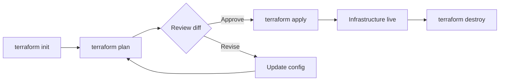
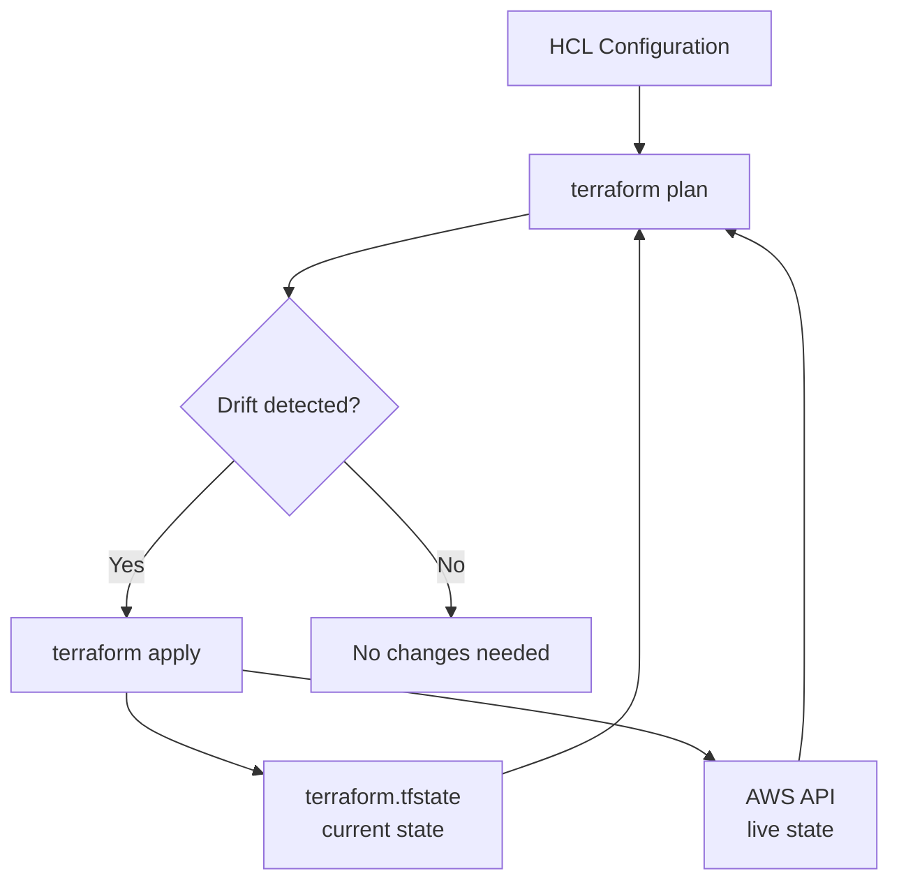
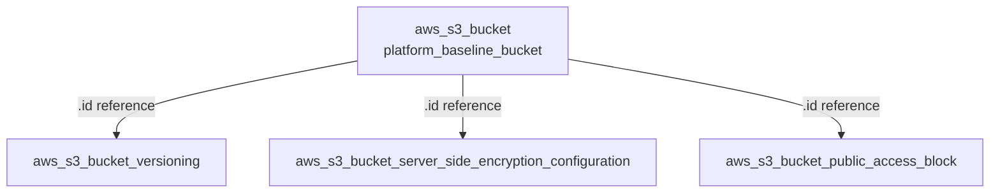
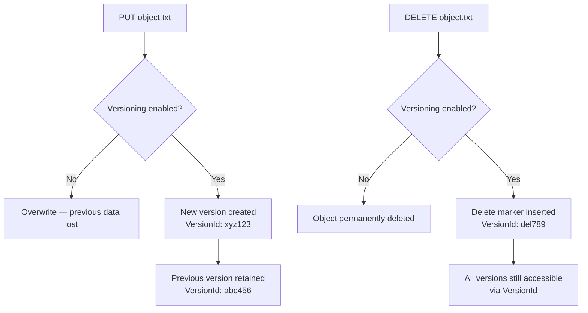
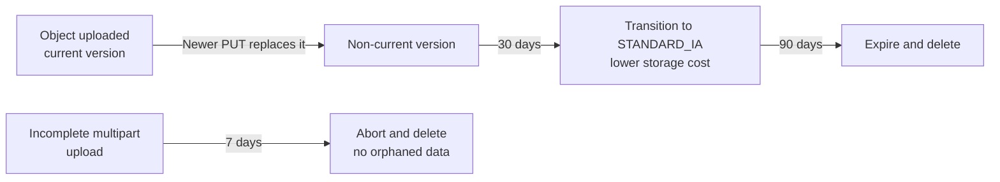
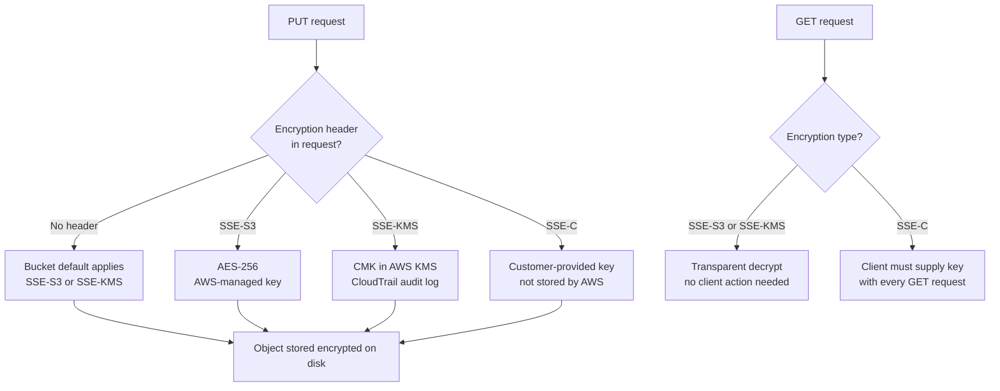
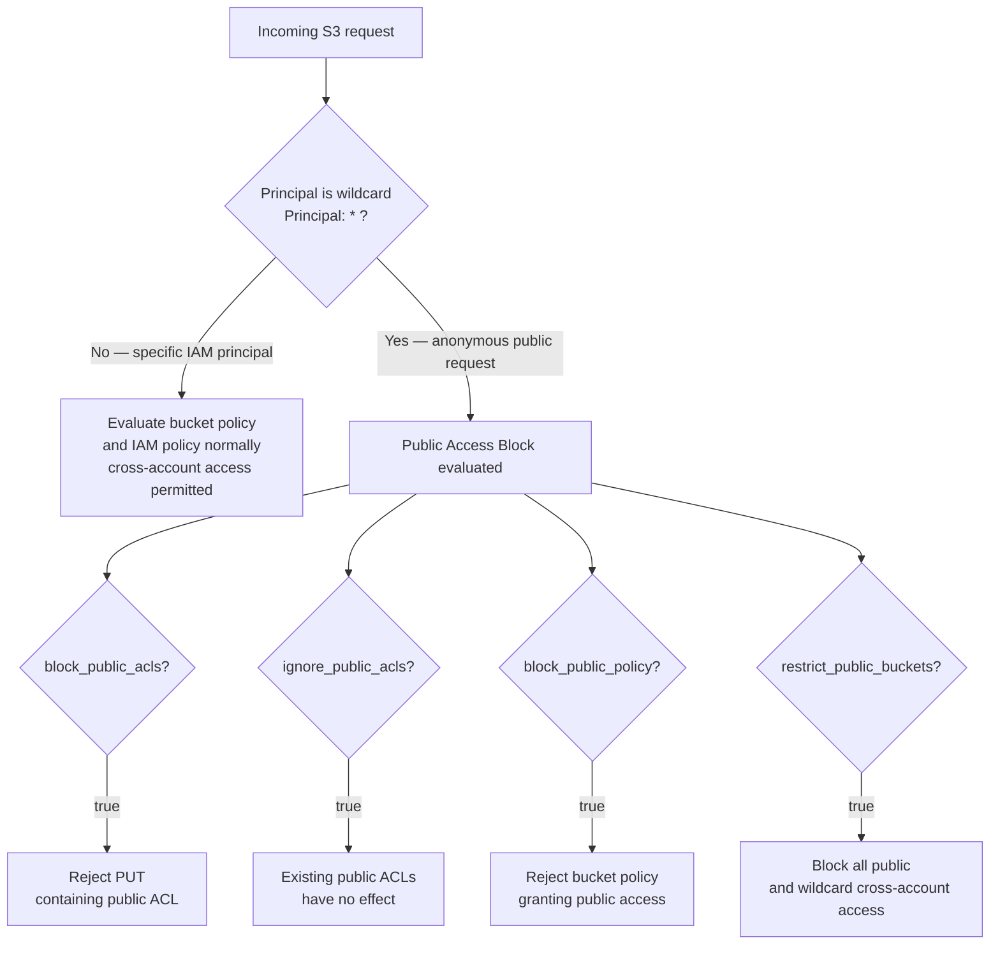
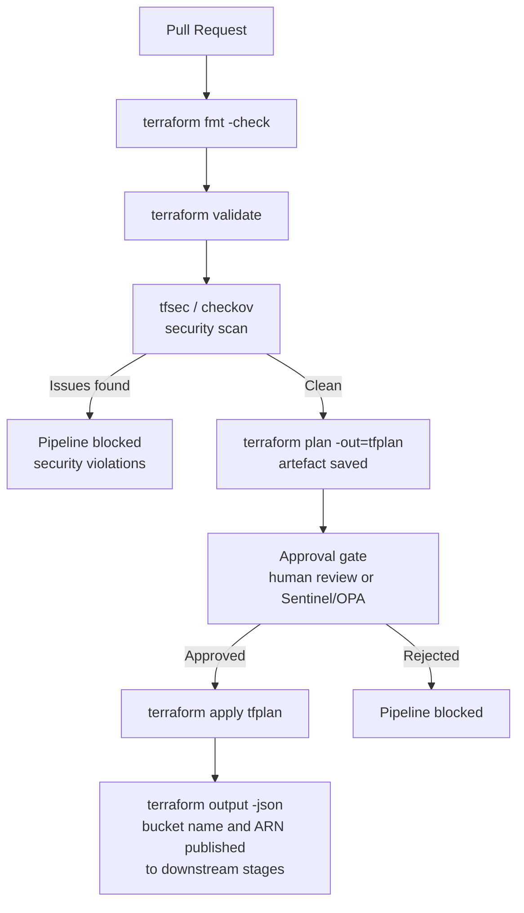

# Interview Questions — S3 Bucket Baseline

DevOps-level interview questions covering the concepts demonstrated in this project. Questions are grouped by topic and progress from foundational to advanced.

---

## Terraform Core Concepts

**Q1. What is the purpose of `terraform init` and what does it do under the hood?**

`terraform init` initialises the working directory by downloading provider plugins defined in `versions.tf`, setting up the backend, and creating the `.terraform.lock.hcl` file. It must be run before any other Terraform command. The lock file pins exact provider binary checksums so that every subsequent `init` on any machine installs the identical provider version.

---

**Q2. What is the difference between `terraform plan` and `terraform apply`?**

`terraform plan` performs a dry run — it reads current state and queries the AWS API to compute what changes would be made, but makes no modifications. `terraform apply` executes those changes. Running `plan -out=tfplan` followed by `apply tfplan` guarantees that exactly what was reviewed gets applied, which is critical in CI/CD pipelines.



---

**Q3. What does `~> 5.0` mean in the AWS provider version constraint?**

The `~>` (pessimistic constraint) operator allows only patch and minor version upgrades within the specified minor version. `~> 5.0` permits `5.0.x`, `5.1.x`, `5.99.x`, but not `6.0.0`. This prevents breaking changes from a major version bump while still receiving bug fixes automatically.

---

**Q4. What is the `.terraform.lock.hcl` file and should it be committed to version control?**

It records the exact provider versions and SHA-256 checksums selected by `terraform init`. **Yes, it should be committed.** Committing it ensures all developers and CI pipelines use the identical provider binary, preventing "works on my machine" issues caused by provider version drift.

---

**Q5. What is Terraform state and why is it important?**

Terraform state (`terraform.tfstate`) maps your configuration resources to real-world infrastructure. Terraform uses it to determine what exists, what needs to change, and what should be destroyed. Without state, Terraform cannot track drift or perform incremental updates — it would attempt to recreate all resources on every apply.



---

**Q6. Why is it recommended to use a remote backend for Terraform state in a team environment?**

A local state file cannot be shared, provides no locking (allowing two engineers to apply simultaneously and corrupt state), and is lost if the machine is destroyed. A remote backend — such as S3 + DynamoDB — solves all three: state is centralised, DynamoDB provides distributed locking, and S3 provides durability and versioning for the state file itself.

---

**Q7. What is `terraform output` used for?**

It reads and displays the values declared in `outputs.tf` from the current state file. Outputs allow downstream Terraform modules, CI/CD pipelines, or application configuration scripts to consume infrastructure values (such as a bucket name or ARN) without hard-coding them.

---

**Q8. What is `terraform destroy` used for and what precautions apply to S3 buckets?**

`terraform destroy` tears down all resources managed by the configuration. For S3 specifically, the operation will fail if the bucket is non-empty unless `force_destroy = true` is set on the bucket resource — this is a safety guard against accidental data deletion. In production, access to `destroy` should be restricted via IAM or pipeline controls, and `force_destroy` should never be enabled to prevent irreversible loss of versioned objects.

---

## S3 Bucket Architecture

**Q9. Why does the project use four separate Terraform resources instead of a single `aws_s3_bucket` block with inline sub-resources?**

AWS provider v4 deprecated inline sub-resource blocks (e.g., `versioning {}`, `server_side_encryption_configuration {}`) to resolve configuration conflicts when the same bucket is managed by multiple configurations. Separate resources follow the single-responsibility principle, allow Terraform to plan each concern independently, and produce cleaner pull request diffs.

---

**Q10. How does Terraform know the order in which to create the four S3 resources?**

Through implicit dependencies. `aws_s3_bucket_versioning`, `aws_s3_bucket_server_side_encryption_configuration`, and `aws_s3_bucket_public_access_block` all reference `aws_s3_bucket.platform_baseline_bucket.id`. Terraform builds a dependency graph and ensures the base bucket is created first before applying the sub-configurations.



---

**Q11. What is the `force_destroy` attribute on `aws_s3_bucket` and when would you use it?**

`force_destroy = true` instructs Terraform to delete all objects (including all versions and delete markers) before destroying the bucket. Without it, Terraform will fail to destroy a non-empty bucket. It is appropriate in non-production or demo environments but should be absent in production to prevent accidental data loss.

---

**Q12. What are the constraints on S3 bucket names and why does naming matter at the platform level?**

S3 bucket names must be globally unique across all AWS accounts and regions, 3–63 characters, lowercase alphanumeric and hyphens only, no underscores, no IP address format, and cannot begin or end with a hyphen. At the platform level, a consistent naming convention — for example `<org>-<env>-<purpose>-<region>` — aids searchability, prevents collisions when the same module is deployed across environments, and makes cost allocation by bucket straightforward in billing reports.

---

## S3 Versioning and Lifecycle Management

**Q13. What does enabling S3 versioning mean for object storage behaviour?**

Once enabled, every `PUT` operation creates a new version of the object rather than overwriting it. A `DELETE` operation inserts a delete marker instead of permanently removing the object. All previous versions remain accessible by specifying the `VersionId`. Versioning cannot be fully disabled once enabled — it can only be suspended, which stops creating new versions but retains existing ones.



---

**Q14. What are the storage cost implications of enabling versioning, and how can they be managed?**

Every version of every object consumes storage and incurs costs. Over time, accumulated versions can significantly increase the bill. This is managed via **S3 Lifecycle policies** that expire non-current versions after a defined number of days or limit the number of retained non-current versions.

---

**Q15. What is the difference between versioning `Enabled`, `Suspended`, and never-enabled?**

| State | Behaviour |
|-------|-----------|
| Never enabled | Single version per key; overwrites and deletes are permanent |
| Enabled | All versions retained; deletes create delete markers |
| Suspended | No new versions created; existing versions remain; new objects get a `null` version ID |

---

**Q16. How would you implement an S3 Lifecycle policy in Terraform to manage version retention?**

Lifecycle rules are a separate resource — `aws_s3_bucket_lifecycle_configuration` — following the same separation-of-concerns pattern as versioning and encryption:

```hcl
resource "aws_s3_bucket_lifecycle_configuration" "retention" {
  bucket = aws_s3_bucket.platform_baseline_bucket.id

  rule {
    id     = "expire-noncurrent-versions"
    status = "Enabled"

    noncurrent_version_transition {
      noncurrent_days = 30
      storage_class   = "STANDARD_IA"
    }

    noncurrent_version_expiration {
      noncurrent_days = 90
    }

    abort_incomplete_multipart_upload {
      days_after_initiation = 7
    }
  }
}
```

Common rules include transitioning non-current versions to `STANDARD_IA` or `GLACIER` to reduce cost, expiring non-current versions after a defined retention period, and aborting incomplete multipart uploads to prevent orphaned partial uploads from accumulating.



---

## S3 Security and Encryption

**Q17. What is the difference between SSE-S3, SSE-KMS, and SSE-C?**

| Type | Key management | Use case |
|------|---------------|---------|
| SSE-S3 (AES-256) | AWS manages keys entirely | General baseline; no compliance key requirements |
| SSE-KMS | AWS KMS manages CMKs; customer controls key policy | Audit trails, cross-account access, HIPAA/PCI |
| SSE-C | Customer provides key per request | Customer retains full key ownership; no AWS key storage |



---

**Q18. If a bucket has a default encryption rule set, what happens when a client uploads an object with a different encryption header?**

The client-specified header takes precedence. The default encryption rule applies only when no encryption header is included in the `PUT` request. This means a well-configured application can use SSE-KMS with a specific CMK even if the bucket default is SSE-S3.

---

**Q19. Does enabling server-side encryption affect how you read objects from S3?**

No. Decryption is transparent — S3 decrypts the object automatically when it is downloaded by an authorised principal. The client does not need to provide a decryption key (for SSE-S3 and SSE-KMS). Only SSE-C requires the client to supply the key on every read request.

---

**Q20. How do you enforce HTTPS-only access to an S3 bucket using a bucket policy?**

A bucket policy with a `Deny` statement on `aws:SecureTransport = false` blocks all HTTP requests:

```json
{
  "Effect": "Deny",
  "Principal": "*",
  "Action": "s3:*",
  "Resource": [
    "arn:aws:s3:::my-bucket",
    "arn:aws:s3:::my-bucket/*"
  ],
  "Condition": {
    "Bool": {
      "aws:SecureTransport": "false"
    }
  }
}
```

In Terraform this is managed with `aws_s3_bucket_policy` using a `data "aws_iam_policy_document"` block. This ensures data in transit is always encrypted regardless of client configuration, and is a common requirement in CIS Benchmark and PCI DSS controls.

---

## S3 Networking and Access Control

**Q21. What are the four public access block settings and what does each one control?**

| Setting | Controls |
|---------|---------|
| `block_public_acls` | Rejects PUT requests that include a public ACL on the bucket or its objects |
| `ignore_public_acls` | Makes S3 ignore any existing public ACLs; does not remove them |
| `block_public_policy` | Prevents bucket policies that grant public access |
| `restrict_public_buckets` | Blocks public and cross-account access to the bucket when a public policy is in effect |



---

**Q22. Can you still grant cross-account access to a bucket with all four public access block settings enabled?**

Yes. The public access block settings restrict **public** (anonymous internet) access, not all cross-account access. An explicit bucket policy or IAM policy that grants access to a specific AWS account or IAM principal in another account will still function normally. Only policies that use `"Principal": "*"` (wildcard) are blocked.

---

**Q23. At what levels can the public access block be configured in AWS?**

It can be configured at two levels:
1. **Account level** — applies to all buckets in the account via the S3 Console "Block Public Access" account setting.
2. **Bucket level** — applies to a specific bucket, as provisioned by `aws_s3_bucket_public_access_block`.

Bucket-level settings can be more restrictive than the account-level setting but cannot be more permissive.

---

**Q24. What is the difference between a bucket policy and an IAM identity policy for controlling S3 access?**

| Feature | Bucket Policy (resource-based) | IAM Identity Policy |
|---------|-------------------------------|---------------------|
| Attached to | The S3 bucket | An IAM user, role, or group |
| Cross-account | Grants access to other accounts directly | Requires a trust relationship |
| Scope | All principals accessing this bucket | All resources this principal accesses |
| Use case | Centralised bucket-level access control | Per-identity permission grants |

In practice both are used together. A bucket policy can restrict access to a specific VPC or account; IAM policies grant specific roles the ability to access specific buckets. Both policies must allow an action for it to succeed (the exception being an explicit `Deny`, which always wins).

---

**Q25. What is an S3 VPC endpoint and why would you use one?**

An S3 VPC endpoint (Gateway type) routes S3 traffic from within a VPC directly to S3 over the AWS private network, bypassing the public internet and the NAT Gateway. Benefits include:

- **Cost**: no NAT Gateway data processing charges for S3-bound traffic.
- **Security**: traffic never traverses the public internet; bucket policies can restrict access to requests originating from the endpoint (`aws:SourceVpce` condition).
- **Performance**: lower latency and higher throughput for workloads with heavy S3 I/O.

In Terraform, provisioned with:

```hcl
resource "aws_vpc_endpoint" "s3" {
  vpc_id       = aws_vpc.main.id
  service_name = "com.amazonaws.us-east-1.s3"
  vpc_endpoint_type = "Gateway"
  route_table_ids   = [aws_route_table.private.id]
}
```

---

## Infrastructure Best Practices

**Q26. What is infrastructure as code (IaC) and why is Terraform preferred for AWS over writing CloudFormation directly?**

IaC means declaring infrastructure in version-controlled configuration files rather than clicking through consoles. Terraform is provider-agnostic (supports AWS, Azure, GCP, and hundreds of others), uses a declarative HCL syntax that is generally considered more readable than CloudFormation JSON/YAML, supports a plan/apply workflow that CloudFormation lacks, and has a large ecosystem of community modules.

---

**Q27. What is configuration drift and how does Terraform detect and correct it?**

Drift occurs when the actual state of a resource in AWS diverges from what is recorded in Terraform state — typically caused by manual console changes. `terraform plan` detects drift by comparing the desired configuration against a live AWS API refresh. Running `terraform apply` corrects drift by bringing the real resource back into alignment with the configuration.

---

**Q28. What is the AWS Well-Architected Framework Security Pillar principle most relevant to this project?**

**"Protect data at rest"** — enforced here through SSE encryption, bucket versioning (enables recovery from destructive operations), and the public access block (prevents unauthorised data exposure). The principle also calls for controlling who has access via IAM, which would be the natural next security layer to add.

---

**Q29. How would you promote this S3 baseline configuration to a reusable Terraform module?**

Extract the resources into a `modules/s3-baseline/` directory, expose input variables for the bucket name, region, tags, and optional KMS key ARN, and output the bucket ID and ARN. Callers instantiate the module with:

```hcl
module "app_bucket" {
  source      = "../../modules/s3-baseline"
  bucket_name = "my-app-bucket"
  aws_region  = "us-east-1"
}
```

This allows the same security baseline to be applied consistently across all buckets in the platform without duplicating resource definitions.

---

**Q30. What is the principle of least privilege and how should it be applied to S3 bucket access?**

Grant only the minimum IAM permissions necessary for a given role or service to perform its function. For an S3 bucket, this means scoping policies to specific actions (`s3:GetObject` for readers, `s3:PutObject` for writers), specific resources (bucket ARN + object prefix), and specific conditions (e.g., `aws:SourceVpc` to restrict to a VPC endpoint). Avoid using `s3:*` on `*` except for administrative automation roles.

---

## Production Architecture Considerations

**Q31. What would you change to make this S3 configuration production-ready?**

- **HTTPS enforcement**: Add a bucket policy with `Deny` on `aws:SecureTransport = false` to block all HTTP access.
- **KMS encryption**: Replace SSE-S3 with SSE-KMS using a customer-managed key (CMK) for CloudTrail audit trails and independent key revocation.
- **Lifecycle policies**: Add `aws_s3_bucket_lifecycle_configuration` to transition non-current versions to cheaper storage classes and expire them after the retention period.
- **Access logging**: Enable S3 server access logging to a separate audit log bucket for request-level auditing.
- **VPC endpoint**: Route all S3 traffic through a Gateway VPC endpoint to remove internet exposure and reduce NAT Gateway costs.
- **Remote state**: Migrate `terraform.tfstate` to S3 + DynamoDB for team workflows and concurrent-apply protection.
- **Tagging**: Enforce consistent tags (`Environment`, `Owner`, `CostCentre`, `ManagedBy`) via provider-level `default_tags`.
- **Object Lock**: For compliance workloads, enable WORM retention via `aws_s3_bucket_object_lock_configuration`.

---

**Q32. How would you manage multiple environments (dev, staging, prod) with this S3 configuration?**

Two common approaches:

1. **Separate state files with `tfvars`**: one Terraform configuration with `dev.tfvars`, `staging.tfvars`, `prod.tfvars` containing environment-specific values (bucket name suffix, KMS key ARN, lifecycle retention periods). Each environment is initialised against a separate S3 backend path. This is explicit and easy to audit.

2. **Terraform workspaces**: `terraform workspace new dev` creates an isolated state namespace. Variable values are controlled using `terraform.workspace` conditionals. Works well when environments are structurally identical.

For S3 specifically, bucket names must be globally unique, so the environment name is typically embedded in the bucket name variable (e.g., `my-app-dev-data`, `my-app-prod-data`). Lifecycle retention periods and KMS key selection commonly also differ by environment.

---

**Q33. How would you implement S3 cross-region replication in Terraform?**

Cross-region replication (CRR) requires versioning enabled on both source and destination buckets and an IAM role with replication permissions:

```hcl
resource "aws_s3_bucket_replication_configuration" "crr" {
  bucket = aws_s3_bucket.source.id
  role   = aws_iam_role.replication.arn

  rule {
    id     = "replicate-all"
    status = "Enabled"

    destination {
      bucket        = aws_s3_bucket.destination.arn
      storage_class = "STANDARD_IA"
    }
  }
}
```

CRR is used for disaster recovery (hot standby in a secondary region), compliance (data residency with auditable backup in a second region), and latency optimisation for geographically distributed reads. Note that CRR only replicates new objects written after replication is enabled; existing objects must be copied separately using S3 Batch Operations.

---

## DevOps and Platform Engineering Considerations

**Q34. How would you integrate S3 bucket provisioning into a CI/CD pipeline?**

A typical pipeline for infrastructure changes:

1. **PR trigger**: `terraform fmt -check` and `terraform validate` on every pull request.
2. **Security scan**: tools such as `tfsec` or `checkov` flag insecure configurations (e.g., missing encryption, public access enabled, no lifecycle policy).
3. **Plan stage**: `terraform plan -out=tfplan` — output saved as a pipeline artefact for review.
4. **Approval gate**: mandatory human approval or automated policy check (Sentinel/OPA) before apply.
5. **Apply stage**: `terraform apply tfplan` — exactly what was reviewed is applied.
6. **Post-apply**: `terraform output -json` captures bucket names and ARNs for downstream pipeline stages (e.g., passing the bucket name to application deployment steps).

State is stored in S3 with DynamoDB locking. The pipeline IAM role is scoped to the specific resources it provisions.



---

**Q35. How would you monitor and audit S3 bucket activity post-deployment?**

Multiple layers:

- **S3 Server Access Logging**: records all requests (requester, operation, object key, response code) to a separate log bucket. Useful for troubleshooting and access auditing.
- **AWS CloudTrail data events**: records object-level API calls (`s3:GetObject`, `s3:PutObject`, `s3:DeleteObject`) with requester identity, IP address, and timestamp. Must be explicitly enabled per bucket — not on by default.
- **CloudWatch request metrics**: 4xx errors, 5xx errors, and request latency per bucket. Requires enabling request metrics on the bucket.
- **S3 Storage Lens**: organisation-wide visibility into storage usage, activity trends, and cost optimisation recommendations.
- **AWS Config**: tracks configuration changes to the bucket resource (e.g., if versioning is disabled or public access is re-enabled after provisioning) and can trigger remediation via Config Rules.

In Terraform, server access logging is provisioned with `aws_s3_bucket_logging`.

---

**Q36. How would you handle sensitive data that must be stored in S3, such as encrypted archives or compliance documents?**

- Use **SSE-KMS** with a customer-managed key so that access to the key — and therefore the data — can be revoked independently of IAM policies. Key policies also enable fine-grained per-principal access control.
- Restrict bucket access via a **bucket policy** scoped to specific VPC endpoint IDs or specific IAM role ARNs, combined with `aws:SecureTransport` enforcement.
- Enable **CloudTrail data event logging** on the bucket to audit every read and write of sensitive objects.
- For compliance workloads requiring tamper-proof retention, enable **S3 Object Lock** (WORM — write once, read many) in Governance or Compliance mode.
- Never store live application secrets (passwords, API keys, tokens) as S3 objects — use **AWS Secrets Manager** or **SSM Parameter Store** for those. S3 is appropriate for encrypted blobs (key material exports, audit archives, compliance documents) but not for secrets retrieved at application runtime.

---
