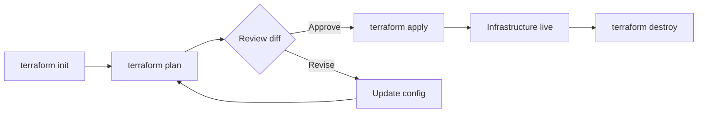
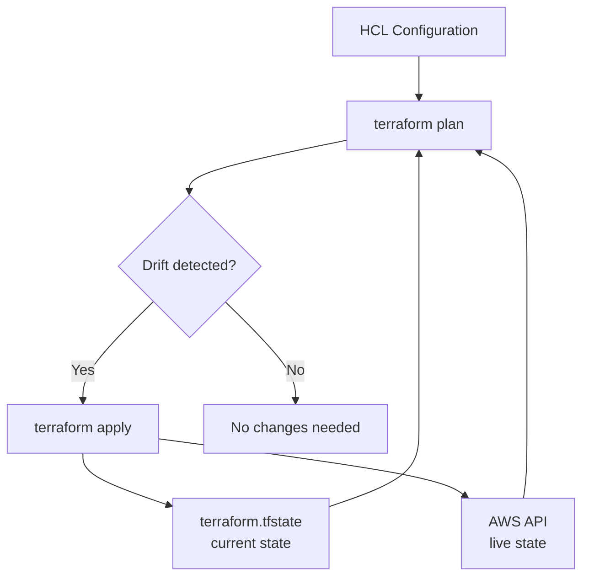
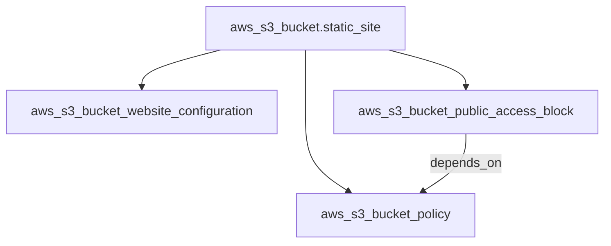
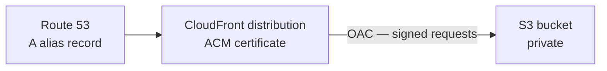
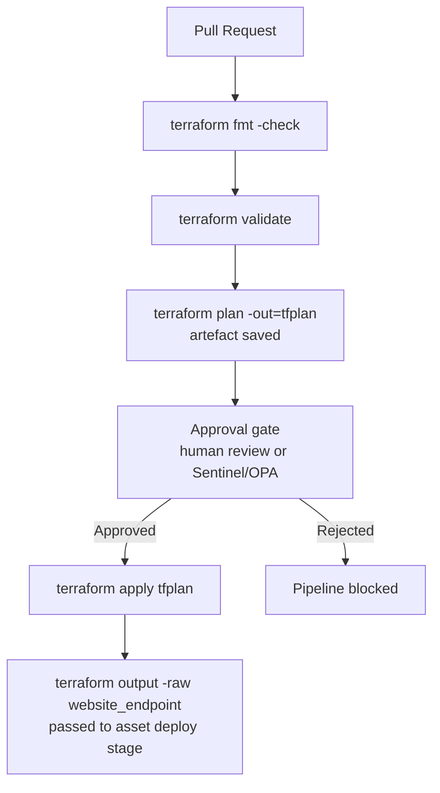

# Interview Questions — S3 Static Site

DevOps-level interview questions covering the concepts demonstrated in this project. Questions are grouped by topic and progress from foundational to advanced.

---

## Terraform Core Concepts

**Q1. What is the purpose of `terraform init` and what does it do under the hood?**

`terraform init` initialises the working directory by downloading provider plugins defined in `versions.tf`, setting up the backend, and creating the `.terraform.lock.hcl` file. It must be run before any other Terraform command. The lock file pins exact provider binary checksums so that every subsequent `init` on any machine installs the identical provider version, preventing "works on my machine" issues caused by provider version drift.

---

**Q2. What is the difference between `terraform plan` and `terraform apply`?**

`terraform plan` performs a dry run — it reads current state and queries the AWS API to compute what changes would be made, but makes no modifications. `terraform apply` executes those changes. Running `plan -out=tfplan` followed by `apply tfplan` guarantees that exactly what was reviewed gets applied, which is critical in CI/CD pipelines where a second `apply` without a saved plan could pick up changes made between the review and the apply step.

**Terraform Workflow**



---

**Q3. What does `~> 5.0` mean in the AWS provider version constraint?**

The `~>` (pessimistic constraint) operator allows only patch and minor version upgrades within the specified minor version. `~> 5.0` permits `5.0.x`, `5.1.x`, `5.99.x`, but not `6.0.0`. This prevents breaking changes from a major version bump while still receiving bug fixes automatically without requiring a manual constraint update.

---

**Q4. What is the `.terraform.lock.hcl` file and should it be committed to version control?**

It records the exact provider versions and SHA-256 checksums selected by `terraform init`. **Yes, it should be committed.** Committing it ensures all developers and CI pipelines use the identical provider binary, preventing scenarios where a developer running `terraform plan` locally uses a different provider binary than the pipeline that runs `terraform apply`.

---

**Q5. What is Terraform state and why is it important?**

Terraform state (`terraform.tfstate`) maps your configuration resources to real-world infrastructure. Terraform uses it to determine what exists, what needs to change, and what should be destroyed. Without state, Terraform cannot track drift or perform incremental updates — it would attempt to recreate all resources on every apply.

**Terraform State and Drift Detection**



---

**Q6. Why is it recommended to use a remote backend for Terraform state in a team environment?**

A local state file cannot be shared, provides no locking (allowing two engineers to apply simultaneously and corrupt state), and is lost if the machine is destroyed. A remote backend — such as S3 + DynamoDB — solves all three: state is centralised, DynamoDB provides distributed locking, and S3 provides durability and versioning for the state file itself. For S3-based infrastructure specifically, storing state in S3 also means the same AWS account manages both the infrastructure and the state backend, simplifying IAM scoping.

---

**Q7. What is `terraform destroy` used for?**

`terraform destroy` tears down all resources managed by the configuration. It generates a destruction plan and requires confirmation before proceeding. Used to clean up demo environments and avoid ongoing cloud costs. For S3 specifically, destroy will fail if the bucket is non-empty — objects must be removed first with `aws s3 rm --recursive` before Terraform can delete the bucket itself.

---

**Q8. What is `terraform output` used for?**

It reads and displays the values declared in `outputs.tf` from the current state file. Outputs allow downstream Terraform modules, CI/CD pipelines, or application configuration scripts to consume infrastructure values (such as the website endpoint) without hard-coding them. In this module, `website_endpoint` is consumed by deployment scripts that upload assets and then run smoke tests against the live URL.

---

## S3 Fundamentals

**Q9. What is Amazon S3 and what distinguishes object storage from block storage?**

S3 is **object storage**: files are stored as flat objects (data + metadata + a unique key) inside buckets. Unlike block storage (EBS), S3 has no file system — objects are retrieved by key using an HTTP-based API. Object storage is optimised for durability (11 nines), elastic scale, and cheap retrieval at internet scale. It is not suitable for workloads requiring low-latency byte-level random access (databases, OS volumes). For static websites, S3 holds HTML, CSS, JS, and image objects and serves them via its website endpoint.

---

**Q10. What is the difference between the S3 REST API endpoint and the website endpoint?**

| Feature | REST API endpoint | Website endpoint |
|---------|------------------|-----------------|
| Hostname format | `bucket.s3.amazonaws.com` | `bucket.s3-website-region.amazonaws.com` |
| Authentication | Signed requests (SigV4) or bucket policy | Bucket policy (anonymous reads OK) |
| Root path (`/`) | Returns bucket XML listing (if allowed) | Serves `index.html` |
| Error handling | S3 XML error response | Serves `error.html` |
| HTTPS | Yes | No — HTTP only from S3 directly |
| Use case | SDK/CLI object operations | Browser-served static sites |

For a static website, you must use the **website endpoint** to get the `index.html` default document behaviour. A direct REST URL to `/` returns an XML listing or an `AccessDenied` error.

---

**Q11. What does "globally unique bucket name" mean, and how does it affect module design?**

S3 bucket names share a **global namespace** across all AWS accounts and all regions. If `acme-corp-assets` is already owned by any account anywhere in the world, no other account can create a bucket with that name. This constraint drives naming conventions: include an account ID, organisation prefix, environment slug, or random suffix. For this module, it is why `bucket_name` has no default — a hardcoded default would collide on the second apply in any account other than the one that first created it.

---

**Q12. What are S3 storage classes and which is appropriate for a static website?**

| Storage class | Retrieval latency | Use case |
|---------------|------------------|----------|
| Standard | Milliseconds | Frequently accessed data — static sites, active datasets |
| Standard-IA | Milliseconds | Infrequently accessed but requires rapid retrieval |
| One Zone-IA | Milliseconds | Non-critical, infrequently accessed, single AZ |
| Glacier Instant | Milliseconds | Archive with millisecond retrieval |
| Glacier Flexible | Minutes–hours | Long-term archive |
| Intelligent-Tiering | Milliseconds | Variable access patterns, auto-tiering |

For a static website, **S3 Standard** is correct — objects are served on every HTTP request and must be retrieved with millisecond latency. Glacier and IA classes are unsuitable because retrieval fees and latency make them expensive and slow for frequently served assets.

---

## S3 Static Website Hosting — Service Specific

**Q13. Why are four separate Terraform resources required for a public static site?**

AWS separates these concerns at the API level, and the AWS provider mirrors that separation:

- `aws_s3_bucket` — creates the bucket (storage container).
- `aws_s3_bucket_website_configuration` — activates the website endpoint and defines the index/error documents; without this, requests to `/` return an XML listing rather than `index.html`.
- `aws_s3_bucket_public_access_block` — controls four independent flags that AWS uses to prevent accidental public exposure; all four must be `false` for a public policy to take effect.
- `aws_s3_bucket_policy` — the actual policy statement that grants `s3:GetObject` to anonymous callers; without this, objects are private even if the public access block is disabled.

All four must be correctly configured. Missing any one of them results in a bucket that is either not serving web content or not publicly readable.

**Resource dependency graph**



---

**Q14. Why must the public access block be disabled before the bucket policy can be applied?**

AWS introduced Block Public Access in 2018 as a safety mechanism to prevent accidental data exposure at both the account and bucket level. When `block_public_policy` or `restrict_public_buckets` are `true`, AWS rejects any `PutBucketPolicy` call that would result in a publicly accessible policy — even if the policy is intentional. The module sets all four block settings to `false` at the bucket level so the `GetObject` for `Principal: "*"` policy is accepted. The `depends_on` in `aws_s3_bucket_policy` ensures this block resource is fully applied before the policy is attached, preventing intermittent `AccessDenied` errors during apply.

---

**Q15. What is the purpose of `depends_on` between the bucket policy and the public access block?**

Terraform builds its dependency graph from resource attribute references. Both `aws_s3_bucket_public_access_block` and `aws_s3_bucket_policy` reference `aws_s3_bucket.static_site.id`, but there is no direct attribute reference between the two child resources. Without an explicit dependency, Terraform may schedule them in parallel or apply the policy before the public access block is fully propagated. The `depends_on` forces the block settings to complete before the policy is evaluated, making applies reliable regardless of API propagation timing.

---

**Q16. How do `index_document` and `error_document` work in S3 website hosting?**

`index_document.suffix` (`index.html`) is appended to requests that target a "directory" path — for example a request to `/` serves `/index.html`, and a request to `/docs/` serves `/docs/index.html`. `error_document.key` (`error.html`) is returned by the website endpoint for HTTP errors such as missing keys (`404`). For single-page applications with client-side routing, this default behaviour is limited — an SPA typically needs all 404s rewritten to `index.html`, which requires CloudFront custom error responses rather than the S3 website endpoint alone.

---

**Q17. What costs does an S3 static website incur?**

| Cost type | Notes |
|-----------|-------|
| Storage | $0.023/GB-month (Standard, `us-east-1`) — linear with object size |
| PUT/COPY/POST requests | $0.005 per 1,000 requests — charged during uploads |
| GET requests | $0.0004 per 1,000 requests — charged on every web page view |
| Data transfer out | $0.09/GB to internet — often dominant at high traffic |
| Data transfer to CloudFront | $0 — no charge from S3 to CloudFront |

For a small demo site with an empty or tiny bucket, monthly cost is negligible. At production traffic levels, CloudFront is strongly recommended: it caches objects at edge locations, drastically reducing the number of GET requests that reach S3 and eliminating data transfer charges from S3 to CloudFront.

---

## Terraform Patterns

**Q18. What is the benefit of separating `versions.tf`, `provider.tf`, `variables.tf`, `main.tf`, and `outputs.tf`?**

Separation of concerns — each file has a single, well-known responsibility. It mirrors community conventions, making the project immediately familiar to any Terraform practitioner. In code review, split files produce cleaner pull request diffs: a change to provider constraints appears only in `versions.tf` rather than mixed with resource definitions. For this module, future additions (CloudFront, Route 53) would be added to their own files rather than growing `main.tf` further.

---

**Q19. How does Terraform determine the order in which the four S3 resources are created?**

Terraform builds a directed acyclic graph (DAG) from resource attribute references and explicit `depends_on` declarations:

- **Implicit**: `aws_s3_bucket_website_configuration`, `aws_s3_bucket_public_access_block`, and `aws_s3_bucket_policy` all reference `aws_s3_bucket.static_site.id`, so the bucket must be created first.
- **Explicit**: `aws_s3_bucket_policy` declares `depends_on = [aws_s3_bucket_public_access_block.static_site]` because there is no direct attribute reference between these two, but the API requires the block settings to be applied before the policy.

The resulting creation order is: bucket → (website_configuration and public_access_block in parallel) → bucket_policy.

---

**Q20. Why is `jsonencode` used for the bucket policy instead of a heredoc string?**

`jsonencode` converts a native HCL expression (maps, lists, strings) to a JSON string. It eliminates escape sequence issues that arise with heredoc JSON — in HCL, embedded JSON requires escaping quotes (`\"`) and is difficult to maintain. With `jsonencode`, the policy structure is written as HCL values, IDE syntax highlighting works correctly, and Terraform can include dynamic references like `aws_s3_bucket.static_site.arn` directly inside the expression without string interpolation complexity.

---

**Q21. What are Terraform output values used for in this module?**

Outputs expose resource attributes after apply — here `bucket_name` and `website_endpoint`. They serve multiple purposes:

1. Human inspection via `terraform output`
2. Consumed by parent modules via `module.<name>.<output>` for module composition
3. Read by CI/CD pipeline steps — for example a deployment step that runs `aws s3 sync` can read the bucket name from `terraform output -raw bucket_name` without hard-coding it
4. Queried programmatically with `terraform output -json` for automation and smoke testing scripts that verify the website endpoint is responding

---

**Q22. What is a `terraform.tfvars` file and how is it used?**

`terraform.tfvars` is an automatically loaded variable definition file. It provides values for variables declared in `variables.tf` without requiring CLI `-var` flags. For this module, it is the practical way to set `bucket_name` once rather than passing `-var` on every command. For multi-environment workflows, separate files such as `dev.tfvars` and `prod.tfvars` are passed explicitly with `-var-file=prod.tfvars`, keeping environment-specific values separate from the variable schema definition.

---

## Security

**Q23. What are the security risks of `Principal: "*"` in a bucket policy?**

`Principal: "*"` grants access to any identity — authenticated or not — anywhere on the internet. For a static website serving public HTML and assets, this is intentional. The risks arise from operational errors:

- A developer accidentally uploads a file containing secrets (database credentials, API keys, private data) to a publicly readable bucket — it is immediately world-readable.
- If `s3:ListBucket` is also granted (not in this module, but a common mistake), attackers can enumerate all object keys, discovering unlinked or sensitive files.
- Objects named predictably (e.g., `backup.sql`, `export.csv`) are trivially discovered by scanners.

**Mitigations:** Restrict `s3:PutObject` to a dedicated deployment IAM role; never store sensitive data in a public bucket; separate public web assets from all other data.

---

**Q24. How does Block Public Access work at account vs bucket level?**

AWS provides public access blocking at three levels:

| Level | Scope | Override |
|-------|-------|---------|
| AWS Organizations | All accounts in the org | Requires SCP modification by org admin |
| Account | All buckets in the account | Requires account-level BPA change by admin |
| Bucket | Individual bucket | Controlled in `aws_s3_bucket_public_access_block` |

Bucket-level settings (as in this module) can be overridden by account-level or org-level settings — they cannot make a bucket more public than the higher-level setting allows. If an account has BPA enabled at account level, this module's bucket will still be private even after `terraform apply`, which causes a `403` on the website URL without any Terraform error.

---

**Q25. What is the difference between S3 bucket policies and S3 ACLs?**

| Feature | Bucket policy | ACL |
|---------|--------------|-----|
| Format | JSON IAM policy | Predefined grants (canned) |
| Granularity | Full IAM conditions, actions, principals | Fixed grant types only |
| Cross-account | Yes — reference any principal ARN | Limited |
| AWS recommendation | Current standard | Legacy — AWS recommends disabling ACLs |
| Object vs bucket | Can apply to both | Can apply to both |

ACLs are a legacy mechanism from S3's earliest design. AWS recommends disabling ACLs entirely (Object Ownership: Bucket owner enforced) and using bucket policies exclusively for access control. This module uses a bucket policy — the correct modern pattern.

---

**Q26. How would you enforce encryption at rest on this bucket in production?**

Add `aws_s3_bucket_server_side_encryption_configuration` with SSE-S3 (free, AWS-managed) or SSE-KMS (additional cost, customer-managed key with audit trail):

```hcl
resource "aws_s3_bucket_server_side_encryption_configuration" "static_site" {
  bucket = aws_s3_bucket.static_site.id

  rule {
    apply_server_side_encryption_by_default {
      sse_algorithm = "AES256"  # SSE-S3
    }
  }
}
```

For a public static website, encryption at rest protects data at the storage layer (important for compliance), but does not affect how browsers retrieve objects — the encryption and decryption happens transparently on the S3 service side.

---

**Q27. What logging and auditing would you add around a static site bucket in production?**

- **S3 server access logging**: captures every HTTP request to the bucket. Requires a separate logging bucket to avoid log recursion. Enabled via `aws_s3_bucket_logging`.
- **AWS CloudTrail data events**: captures `GetObject`, `PutObject`, `DeleteObject` API calls. Useful for security investigation but adds cost — enable selectively on high-value buckets.
- **CloudWatch metrics via CloudFront**: if CloudFront is in front, request count, error rate, and origin latency metrics are available by default.
- **S3 Storage Lens**: account-wide storage analytics including request metrics, data protection status, and cost efficiency recommendations.

---

## Production Readiness

**Q28. What would you change to make this module production-ready?**

- **HTTPS and custom domain**: add CloudFront with OAC and an ACM certificate; keep the bucket private (all BPA settings `true`); add a Route 53 A/AAAA alias to the distribution.
- **Private bucket**: remove public access block relaxation and the `Principal: "*"` policy; CloudFront OAC issues signed S3 requests instead.
- **Encryption**: add default bucket encryption (SSE-S3 or SSE-KMS).
- **Versioning**: enable `aws_s3_bucket_versioning` to retain previous object versions for rollback.
- **Access logging**: enable S3 server access logging to a dedicated log bucket.
- **Remote state**: migrate `terraform.tfstate` to an S3 backend with DynamoDB locking.
- **Least-privilege IAM for deployers**: scope the CI/CD role to `s3:PutObject` and `s3:DeleteObject` on the specific bucket ARN only, not all S3 operations.

---

**Q29. How would you add HTTPS and a custom domain to this module?**

The pattern requires three additional services: CloudFront, ACM, and Route 53.



In Terraform:
1. `aws_acm_certificate` + `aws_acm_certificate_validation` in `us-east-1` (CloudFront requires ACM certs in us-east-1 regardless of bucket region).
2. `aws_cloudfront_distribution` with an S3 origin, `aws_cloudfront_origin_access_control`, and the ACM certificate ARN.
3. `aws_route53_record` with an `alias` block pointing to the CloudFront distribution domain.
4. Remove public bucket access and replace the bucket policy with one that grants `s3:GetObject` only to the CloudFront OAC principal.

---

**Q30. How would you manage multiple environments (dev, staging, prod) with this configuration?**

Two common approaches:

1. **Separate `tfvars` files with separate state paths**: one configuration with `dev.tfvars`, `staging.tfvars`, `prod.tfvars`. Each contains a unique `bucket_name` and `environment`. Each initialises against a separate S3 backend path. This is explicit and easy to audit.

2. **Terraform workspaces**: `terraform workspace new dev` creates an isolated state namespace. The `bucket_name` variable is set per workspace using workspace-conditional locals. Workspaces work well when environments are structurally identical.

For production platforms, separate `tfvars` files and separate S3 backend paths per environment provide clearer isolation and a safer blast radius than workspaces — changing `prod.tfvars` cannot accidentally affect `dev` state.

---

**Q31. How would you convert this configuration into a reusable Terraform module?**

Extract the resources into a `modules/s3-static-site/` directory, expose input variables for the bucket name, environment, index document, error document, tags, and an optional CloudFront flag. Output the bucket ARN, bucket name, and website endpoint (or CloudFront domain). Callers instantiate the module with:

```hcl
module "marketing_site" {
  source      = "../../modules/s3-static-site"
  bucket_name = "acme-marketing-${var.environment}"
  environment = var.environment
  tags        = { Owner = "marketing-team" }
}
```

This enforces consistent bucket configuration across all static sites in the platform without duplicating resource definitions.

---

## DevOps and Platform Engineering

**Q32. How would you integrate S3 static site provisioning into a CI/CD pipeline?**

A typical infrastructure pipeline:

1. **PR trigger**: `terraform fmt -check` and `terraform validate` on every pull request.
2. **Plan stage**: `terraform plan -out=tfplan -var-file=env/dev.tfvars` — output saved as a pipeline artefact.
3. **Approval gate**: mandatory human approval before apply on staging or production environments.
4. **Apply stage**: `terraform apply tfplan` — exactly what was reviewed is applied.
5. **Post-apply**: `terraform output -raw website_endpoint` captured and passed to the asset deployment stage.



---

**Q33. How do you safely deploy static assets to the bucket after infrastructure is provisioned?**

Use `aws s3 sync` with `--delete` only when a full mirror is intended, and set `Cache-Control` headers for browser and CDN caching:

```bash
BUCKET=$(terraform output -raw bucket_name)

aws s3 sync ./dist/ s3://${BUCKET}/ \
  --delete \
  --cache-control "max-age=86400" \
  --exclude "index.html" \
  --include "*"

# Upload index.html last with no-cache to ensure users always get the latest
aws s3 cp ./dist/index.html s3://${BUCKET}/index.html \
  --cache-control "no-cache, no-store, must-revalidate"
```

If CloudFront is in front, invalidate the distribution after upload to clear edge caches:
```bash
aws cloudfront create-invalidation \
  --distribution-id $CF_DIST_ID \
  --paths "/*"
```

---

**Q34. What monitoring would you add around an S3 static site post-deployment?**

- **S3 CloudWatch metrics** (requires enabling request metrics on the bucket): total request count, 4xx and 5xx error rates, bytes downloaded. Set CloudWatch Alarms on error rate thresholds.
- **Availability check**: a synthetic monitor (CloudWatch Synthetics canary or an external uptime monitor) that fetches the website endpoint and verifies `200 OK` and expected content.
- **CloudFront metrics** (if applicable): cache hit ratio, origin request count, error rate — available out of the box via the CloudFront console.
- **S3 server access logs**: shipped to a log bucket and optionally to CloudWatch Logs Insights for ad-hoc query on request patterns.

---

**Q35. What is configuration drift for S3 and how does Terraform detect and correct it?**

Drift occurs when the actual state of a resource in AWS diverges from what is recorded in Terraform state — typically caused by manual console edits. Common S3 drift scenarios: someone disables website hosting, adds a new lifecycle rule, tightens the bucket policy, or re-enables a public access block setting. `terraform plan` detects drift by refreshing state against the live AWS API and comparing against the desired configuration. Running `terraform apply` corrects drift by re-applying the configuration. For automated drift detection, run `terraform plan` on a schedule in CI and raise alerts when a non-empty diff is detected.

---

**Q36. How does the AWS Well-Architected Framework apply to this static site module?**

- **Security Pillar — reduce attack surface**: the `Principal: "*"` policy is a deliberate, documented trade-off for a foundation demo. Production should use a private bucket with CloudFront OAC to eliminate direct internet access to S3.
- **Reliability Pillar — recover from failure**: S3 Standard provides 99.999999999% durability and 99.99% availability within a region. For higher availability SLAs, cross-region replication and Route 53 failover to a secondary distribution cover regional outages.
- **Cost Optimisation Pillar — use the right pricing model**: S3 Standard is correct for actively served content. Lifecycle rules can transition old versions (if versioning is enabled) to cheaper storage classes.
- **Performance Efficiency Pillar — use caching**: CloudFront edge caching reduces origin request count and latency globally — the most impactful single improvement for a public static site with geographically distributed users.
