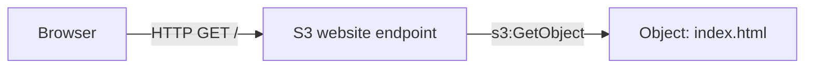
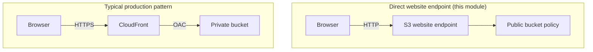
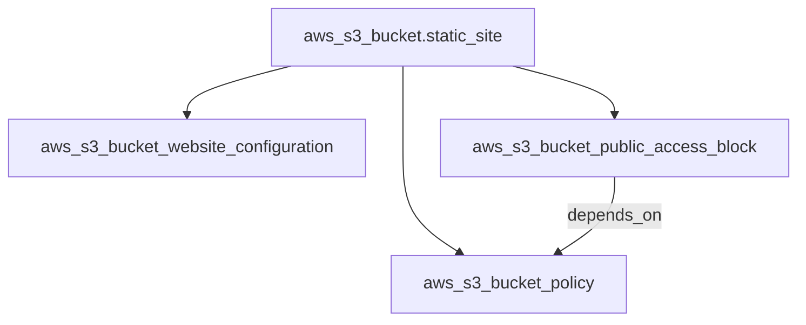
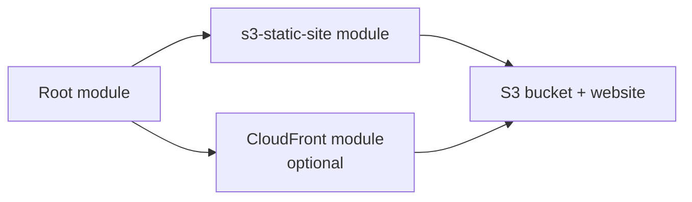
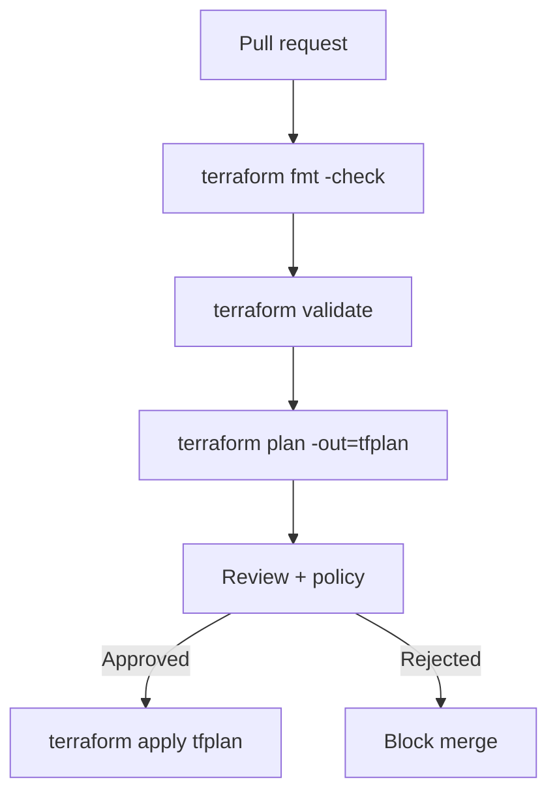

# Interview Questions — S3 Static Site

DevOps-level interview preparation for S3 static website hosting, security trade-offs, and the Terraform patterns used in this module. Topics move from foundational concepts through production and platform engineering concerns.

---

## Foundational Concepts

**Q1. What is Amazon S3 and what problems does it solve?**

S3 is object storage: you store **objects** (files plus metadata) in **buckets** (containers with optional features like versioning and encryption). It offers durability, elastic scale, and pay-per-use pricing. For static websites, S3 holds HTML, CSS, JS, and images; combined with website configuration, the bucket can serve content over HTTP via a dedicated **website endpoint**.

**S3 static site flow (high level)**

---

**Q2. What is the difference between the S3 REST endpoint and the website endpoint?**

The **REST API endpoint** (`s3.amazonaws.com` or regional virtual-hosted style) is the general-purpose API for signed requests, SDKs, and fine-grained access. The **website endpoint** (`s3-website-<region>.amazonaws.com`) is specialised for static hosting: it maps `/` to `index.html`, serves `error.html` for errors, and does **not** support all S3 API features. Website endpoints are **HTTP only** from S3; HTTPS typically requires CloudFront in front.

---

**Q3. What does “globally unique bucket name” mean?**

Within AWS, bucket names share a **global** namespace across all accounts. Two customers cannot own the same bucket name. That constraint drives operational patterns: include environment, account, or random suffixes; avoid hardcoding a single demo name in shared modules.

---

**Q4. What is Infrastructure as Code (IaC) and why use Terraform for S3?**

IaC declares infrastructure in versioned files. Terraform’s **plan** step shows diffs before changes, state tracks real resources, and the same module can be reused across environments with different variables. For S3, IaC makes bucket policies, public access settings, and website configuration **auditable** and repeatable instead of click-ops.

---

## S3 Static Website Deep Dive

**Q5. Which AWS resources are required for a public S3 static site like this module?**

At minimum: an **`aws_s3_bucket`**; **`aws_s3_bucket_website_configuration`** to enable the website endpoint and define index/error documents; **`aws_s3_bucket_public_access_block`** relaxed appropriately if you attach a public policy; and **`aws_s3_bucket_policy`** granting `s3:GetObject` to anonymous callers on `arn:aws:s3:::bucket/*`. Without the policy (and matching public access settings), objects are not world-readable.

---

**Q6. Why does this module set every `aws_s3_bucket_public_access_block` attribute to `false`?**

AWS introduced **Block Public Access** to prevent accidental data exposure. A public **bucket policy** can still be rejected if block settings disallow public policies. For an intentionally public static bucket, this module turns those four knobs off **at the bucket level** so the public read policy can attach. In production, many teams instead keep the bucket **private** and use **CloudFront with Origin Access Control (OAC)** so the bucket never needs public read.

**Public site vs private bucket + CloudFront**

---

**Q7. What is the purpose of `depends_on` between the bucket policy and the public access block resource?**

Terraform builds a dependency graph from references, but sometimes API ordering still matters: if a policy is evaluated while public access block still forbids public policies, **apply can fail intermittently**. Explicit `depends_on` forces the public access block to complete before attaching the policy, improving reliability of this small graph.

---

**Q8. How do `index_document` and `error_document` behave?**

`index_document.suffix` (here `index.html`) is appended for requests to a “directory” path such as `/` or `/prefix/`. `error_document.key` (`error.html`) is returned for error responses routed by the website endpoint (for example missing keys), which is useful for single-page app–style routing only in limited cases — advanced SPAs often use CloudFront **custom error responses** to rewrite 404 → `index.html`.

---

**Q9. What S3 costs should you discuss for a static site?**

Pricing includes **storage** per GB-month, **requests** (GET/PUT), and **data transfer** out to the internet. For a small demo site, cost is usually negligible. At scale, **CloudFront** reduces origin GETs and improves latency; **S3 Intelligent-Tiering** or lifecycle rules matter for large media libraries.

| Charge type | Typical static site note |
|-------------|---------------------------|
| Storage | Linear with total object size |
| GET requests | Grows with traffic; CloudFront caches reduce origin hits |
| Data transfer out | Often dominant at high traffic without a CDN |

---

## Terraform Patterns

**Q10. Why are `versions.tf` and `provider.tf` separate from `main.tf`?**

Community convention: pin core and provider versions in **`versions.tf`**, configure **`provider`** blocks in `provider.tf`, and keep **`main.tf`** focused on resources. Reviewers find constraints quickly, and provider upgrades are isolated in diffs.

---

**Q11. How does Terraform decide create order for the four S3 resources?**

Implicit dependencies: `website_configuration`, `public_access_block`, and `bucket_policy` reference `aws_s3_bucket.static_site.id`, so the bucket is created first. The bucket policy adds an **explicit** `depends_on` the public access block. The resulting **DAG** ensures a coherent apply.

---

**Q12. What are Terraform outputs used for in this module?**

`bucket_name` confirms the bucket identity (useful for scripts and CI). `website_endpoint` surfaces the **exact hostname** clients should use for HTTP tests. Parent modules can consume these via `module.s3_static_site.website_endpoint` without parsing AWS responses.

---

**Q13. Why might `terraform destroy` fail on S3 even when configuration is correct?**

S3 **does not delete non-empty buckets** unless you enable **force destroy** on the bucket resource or empty objects first. Versioned objects and delete markers require extra cleanup. This is a frequent operations gotcha in interviews.

---

**Q14. What is the risk of storing secrets in Terraform variables for S3 modules?**

Strings used in resources often end up in **state files**. Even if bucket names are non-secret, **access keys, passwords, or presigned secret URLs** in variables leak via state and MRs. Prefer IAM roles, environment-assumed roles in CI, and secret stores for sensitive values.

---

## Security

**Q15. What is wrong with long-lived public `s3:GetObject` for `Principal: "*"`?**

It is correct for **intentionally public** marketing sites; it is wrong if any sensitive object lands in the same bucket. Attackers enumerate keys where listing is possible, and mis-uploads become instantly world-readable. **Separation of buckets** and **least privilege** for writers (`PutObject` only for deployment roles) reduce impact.

---

**Q16. How does Block Public Access interact with bucket ACLs and bucket policies?**

Block Public Access can override or ignore ACLs and block public **policies**. Defence in depth: even with a harmless ACL, account-level BPA can prevent public exposure. Operators must understand **account**, **bucket**, and **Org-level** BPA hierarchy before enabling public sites.

---

**Q17. How would you enforce encryption at rest for S3 in production?**

Use **SSE-S3** or **SSE-KMS** default bucket encryption; for many orgs, **KMS** enables key policies and audit trails. Static website hosting reads objects anonymously — encryption at rest still applies on the server side; you must not confuse that with client-side encryption that browsers cannot decrypt without keys.

---

**Q18. What logging and monitoring would you add around a static bucket?**

Enable **S3 server access logging** to a dedicated logging bucket, ship metrics to **CloudWatch**, and use **CloudTrail data events** (selective, cost-aware) for object-level auditing. At the edge, **CloudFront logs** and **WAF** give request-level visibility.

---

## Production Readiness

**Q19. How would you make this module production-ready for a marketing site?**

Add **CloudFront** with **OAC**, **ACM certificate**, **Route 53** alias to distribution, **S3 default encryption**, **versioning** (optional), **least-privilege IAM** for deployers, **remote state** with locking, and possibly **WAF**. Remove direct public bucket access; keep bucket private.

---

**Q20. How do you model multiple environments (dev, prod) without sharing buckets?**

Separate **state** and **bucket names** per environment (`tfvars` or separate workspaces). Never share production buckets with dev deploy credentials. Tag buckets with `Environment` as this module does with `var.environment`.

---

**Q21. What belongs in a reusable Terraform module for static hosting?**

Inputs: name prefix or full bucket name policy, tags, optional CloudFront flag, encryption settings. Outputs: bucket ARN, website or distribution domain, deployment role ARN. Avoid baking in global unique literals; expose naming callbacks or `locals` patterns.

**Module reuse (conceptual)**

---

## DevOps and Platform Engineering

**Q22. How would you put this Terraform in a CI/CD pipeline?**

Stages often include `fmt`, `validate`, `plan` on pull requests, **manual or policy** approval, `apply` on main, and artefact retention of **plan files**. The role running Terraform should **assume** a restricted role per account with S3 permissions scoped to known bucket prefixes.

---

**Q23. How do you deploy static assets safely after the bucket exists?**

Use **`aws s3 sync`** from CI, **incremental uploads**, and **cache-control** headers (often via **CloudFront** metadata). Prefer **`--delete`** only when you intend full mirror behaviour; accidental deletes cause outages. **Multi-factor approvals** for production buckets reduce risk.

---

**Q24. What reliability features might you pair with S3 static hosting?**

**CloudFront** multi-edge caching, **health checks** on the distribution, **Route 53** failover to another region or maintenance page, and **S3 cross-region replication** for hot DR copies (paired with careful invalidation strategy).

---

**Q25. How does this module relate to the AWS Well-Architected Reliability and Security pillars?**

- **Security:** Public read is a deliberate trade-off; production should use private buckets and edge controls.
- **Reliability:** Single-region S3 is highly durable, but **your** deployment process and DNS/CloudFront layers define availability to users.  
- **Cost optimisation:** Lifecycle rules, correct storage class, and CDN caching reduce spend.

---

**Q26. When would you choose S3 static hosting versus containers or serverless for a “web” workload?**

| Option | Fit |
|--------|-----|
| S3 + CDN | Static sites, SPAs built to static files, documentation |
| ECS/Lambda + API | Dynamic APIs, auth, SSR that cannot be pre-rendered |

If the workload is “files only,” S3 with CloudFront is simpler and cheaper than running servers for traffic that only needs GETs.

---

**Q27. What operational runbooks would you write for this stack?**

Include: “empty bucket before destroy,” “rotate deployer IAM keys or roles,” “invalidate CloudFront after deploy,” “rollback by restoring previous object versions,” and “break-glass disable public policy” steps for incident response — aligned with how your org treats public buckets.

---

**Q28. How do you prevent Terraform state contention in a team?**

Use **remote backend** (S3) with **DynamoDB locking**; avoid local state on laptops for shared infrastructure. Branch locks and pipeline serialisation further reduce collision.

---

**Q29. What is configuration drift for S3 and how do you detect it?**

Drift occurs when someone edits the bucket in the Console (policy, website settings, lifecycle). `terraform plan` refreshes from the AWS API and shows differences. Scheduled **plan-only** CI jobs alert when drift is non-empty.

---

**Q30. Why might you add a `random_id` or `random_string` to bucket naming in automation?**

To avoid **name collisions** and race conditions when many workspaces create buckets concurrently. The trade-off is less human-readable names unless you also embed a stable prefix.

---

This set is intentionally deeper than a checklist: practice explaining **why** public buckets differ from **CloudFront/OAC**, **how Terraform ordering** affects S3 policies, and **what you would add** before accepting production traffic.
