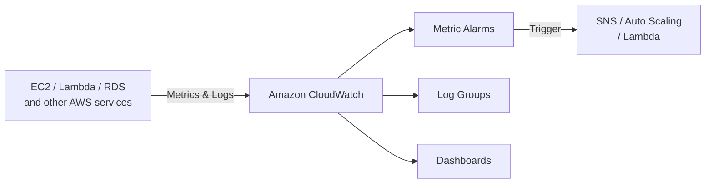
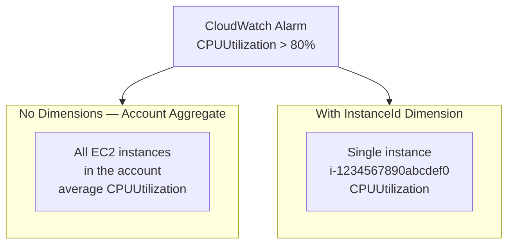
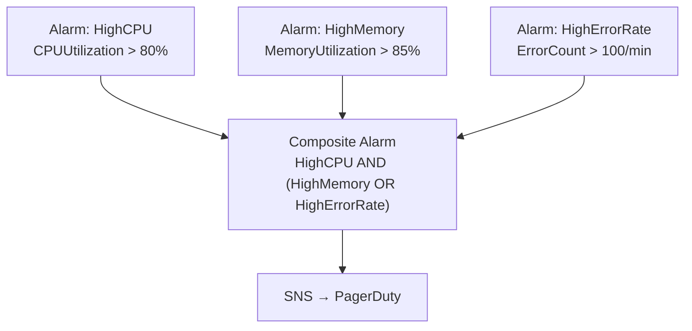
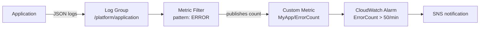
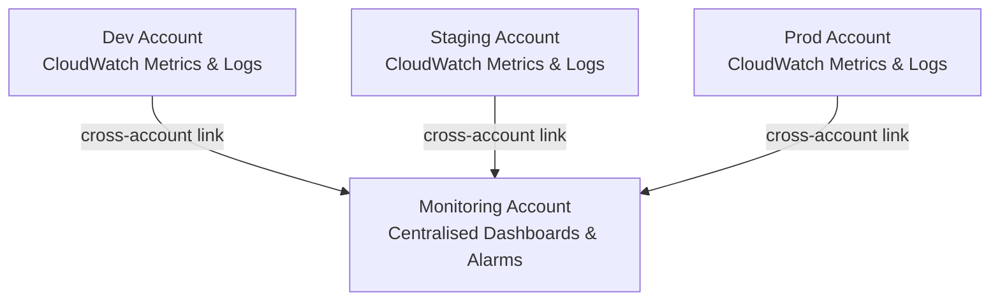
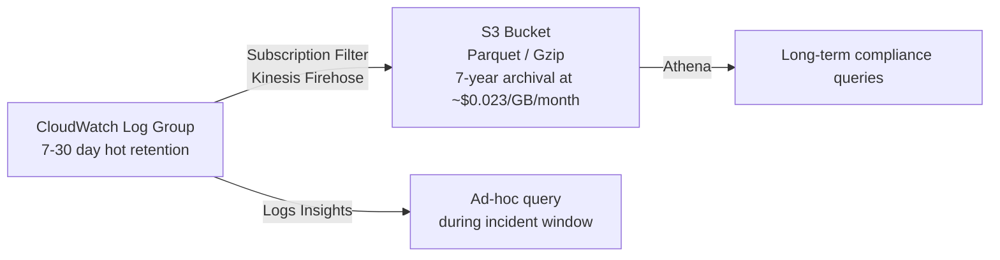
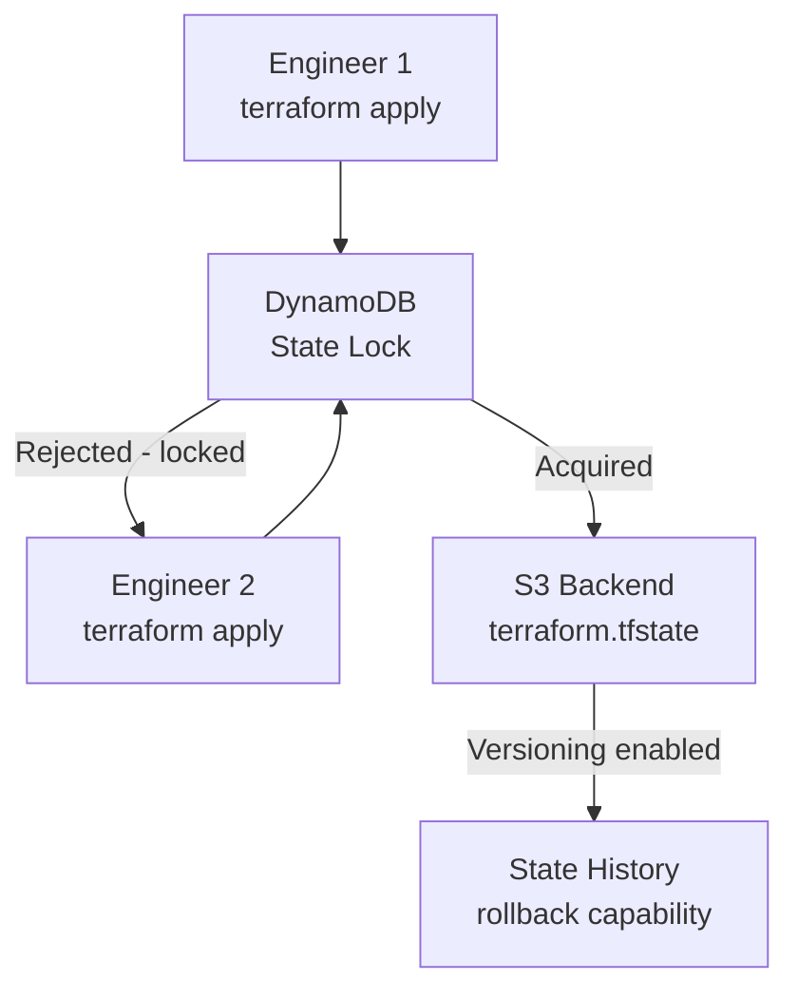
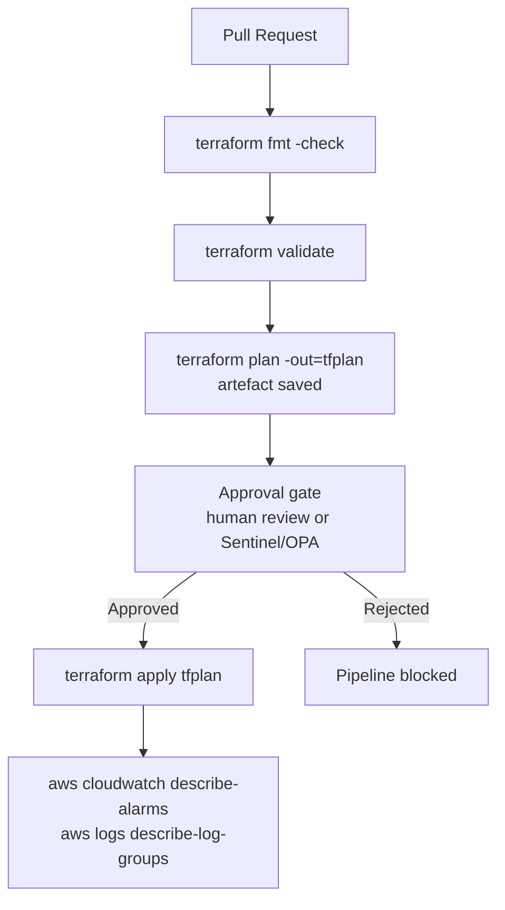
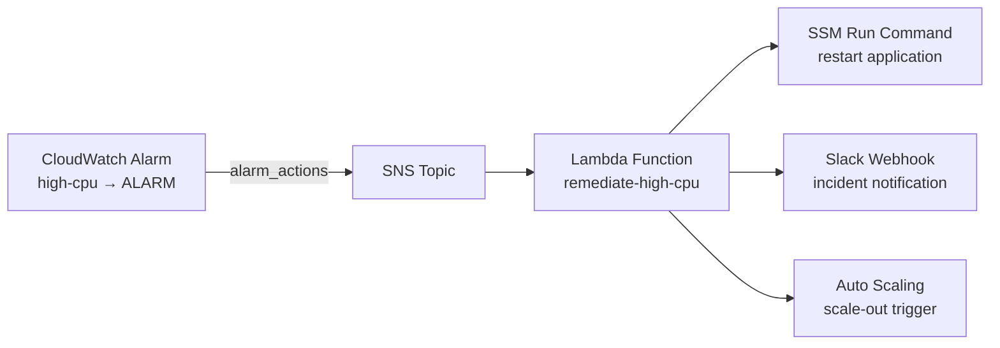

# Interview Questions — CloudWatch Baseline

DevOps-level interview questions covering the concepts demonstrated in this project. Questions are grouped by topic and progress from foundational to advanced.

---

## Foundational CloudWatch Concepts

**Q1. What is Amazon CloudWatch and what problems does it solve?**

Amazon CloudWatch is AWS's native observability service. It collects metrics, logs, and events from AWS services and custom workloads, provides alarming and visualisation, and enables automated responses to operational changes. Without CloudWatch, operators would have no centralised visibility into the health, performance, or usage patterns of their AWS infrastructure. It solves three core observability problems: metrics collection and alerting, log aggregation and querying, and event-driven automation.



---

**Q2. What is a CloudWatch Log Group and how does it differ from a Log Stream?**

A **Log Group** is a named container that groups log streams sharing the same retention, access control, and metric filter settings. A **Log Stream** is a sequence of log events from a single source — typically a single EC2 instance, Lambda function execution environment, or application process. Log Groups define the data lifecycle; Log Streams are the individual emitters within that lifecycle.

| Concept | Scope | Created by |
|---------|-------|-----------|
| Log Group | Container for related streams | You (or Terraform) |
| Log Stream | Single source of log events | The emitting agent (CloudWatch Agent, Lambda, etc.) |
| Log Event | Individual timestamped log entry | The application |

---

**Q3. What is a CloudWatch metric and what is a namespace?**

A **metric** is a time-ordered set of numeric data points representing a measurable value — CPU percentage, request count, latency in milliseconds. Every metric belongs to a **namespace**, which is a container that isolates metrics from different sources to prevent naming collisions. AWS services publish metrics under reserved namespaces like `AWS/EC2`, `AWS/RDS`, and `AWS/Lambda`. Custom application metrics are published under a user-defined namespace such as `MyApp/WebTier`. In this module, the alarm monitors the `AWS/EC2` namespace, which is where EC2 automatically publishes `CPUUtilization`, `NetworkIn`, `NetworkOut`, and other instance-level metrics.

---

**Q4. What is a CloudWatch metric alarm and what states can it be in?**

A metric alarm watches a single CloudWatch metric (or the result of a math expression) and performs actions when the metric crosses a threshold for a required number of evaluation periods. A metric alarm has three possible states:

| State | Meaning |
|-------|---------|
| `OK` | The metric is within the defined threshold |
| `ALARM` | The metric has breached the threshold for the required number of consecutive evaluation periods |
| `INSUFFICIENT_DATA` | Not enough data has been received to evaluate the alarm — common on new alarms or when the monitored resource is not running |

---

**Q5. What is the difference between CloudWatch Metrics and CloudWatch Logs?**

**Metrics** are numeric time-series data points stored in the CloudWatch metrics data store, aggregated at configurable periods, and used for alarming and dashboards. They are pre-aggregated — you cannot inspect individual metric events. **Logs** are unstructured or structured text events stored in Log Groups. Logs retain the full event detail and can be queried with Logs Insights. You can create **Metric Filters** on Log Groups to extract numeric values from log patterns and publish them as custom metrics, bridging the two systems — for example, counting `ERROR` log entries per minute and alarming when that count exceeds a threshold.

---

**Q6. What are CloudWatch alarm dimensions and why does this module omit them?**

Dimensions are key-value pairs that narrow a metric to a specific resource. For example, `{ InstanceId = "i-1234567890abcdef0" }` scopes a `CPUUtilization` alarm to a single EC2 instance. Without dimensions, the alarm monitors the account-wide aggregate of that metric across all instances. This module omits dimensions because no EC2 instance ID is known at the time the module is applied — it is a standalone observability baseline not coupled to any specific compute module. The `INSUFFICIENT_DATA` state is expected until EC2 instances emit metrics.



---

## Service-Specific — CloudWatch Deep Dive

**Q7. What metrics does EC2 publish to CloudWatch by default, and what requires the CloudWatch Agent?**

EC2 publishes the following metrics to `AWS/EC2` by default under basic monitoring (5-minute resolution):

| Metric | Description |
|--------|-------------|
| `CPUUtilization` | Percentage of EC2 compute units in use |
| `NetworkIn` / `NetworkOut` | Bytes transferred in/out of the instance |
| `DiskReadOps` / `DiskWriteOps` | Instance store disk I/O operations |
| `StatusCheckFailed` | Combined instance and system status check failures |

**Memory utilisation and disk space are not published by default.** They require installing the CloudWatch Agent on the instance, which reads OS-level metrics and pushes them to a custom namespace (typically `CWAgent`). This is a common interview gotcha — `MemoryUtilization` is absent from the default `AWS/EC2` namespace.

---

**Q8. What is the difference between basic monitoring and detailed monitoring for EC2?**

| Feature | Basic Monitoring | Detailed Monitoring |
|---------|-----------------|---------------------|
| Metric resolution | 5-minute granularity | 1-minute granularity |
| Cost | Included | Additional charge per instance |
| Use case | General operational awareness | Responsive alarming, Auto Scaling triggers |
| Minimum alarm period | Effectively 5 minutes | 60 seconds |

Detailed monitoring is enabled per instance via `monitoring { enabled = true }` in the `aws_instance` resource. For production workloads that need fast Auto Scaling responses or sub-5-minute detection, detailed monitoring is required.

---

**Q9. What are the available CloudWatch metric statistics and when would you use each?**

A statistic determines how data points are aggregated within each evaluation period before comparison to the threshold:

| Statistic | Description | Use Case |
|-----------|-------------|----------|
| `Average` | Mean value across the period | CPU utilisation — this module |
| `Sum` | Total of all data points | Request counts, error counts |
| `Minimum` | Lowest data point | Detecting when a metric drops below a floor |
| `Maximum` | Highest data point | Catching peak spikes that average would hide |
| `SampleCount` | Number of data points received | Validating that metrics are being emitted |
| `p99` / `p95` (percentile) | Value at the Nth percentile | Latency alarming — average masks tail latency |

For latency alarms, **always use a percentile statistic** (e.g., `p99`) rather than `Average`. An average latency of 200ms can hide a p99 of 5 seconds, which customers directly experience.

---

**Q10. What is the `treat_missing_data` attribute on a CloudWatch alarm and why does it matter?**

`treat_missing_data` controls how the alarm evaluates a period in which no metric data was received. Options:

| Value | Behaviour | Risk |
|-------|-----------|------|
| `missing` (default) | The period is treated as missing; alarm state does not change | Can mask a resource that has stopped emitting — dangerous for uptime alarms |
| `notBreaching` | Missing data is treated as within threshold | Alarm stays `OK` when a resource disappears — always use with caution |
| `breaching` | Missing data is treated as a threshold violation | Forces `ALARM` if metrics stop — best for uptime monitoring |
| `ignore` | Missing periods are skipped; the alarm requires non-missing data to evaluate | Useful for metrics that legitimately have gaps |

For a CPU alarm that should fire if an instance stops reporting, set `treat_missing_data = "breaching"`. For a request count alarm on a service that is legitimately idle overnight, `"notBreaching"` or `"ignore"` prevents false pages.

---

**Q11. What are evaluation periods and data points to alarm, and what is the difference between them?**

**Evaluation periods** (`evaluation_periods`) is the total number of periods checked. **Data points to alarm** (`datapoints_to_alarm`) is the number of those periods that must breach the threshold to trigger the alarm. When `datapoints_to_alarm` is not set, it defaults to equal `evaluation_periods` — meaning all evaluated periods must breach (consecutive breach required). Setting `datapoints_to_alarm` lower than `evaluation_periods` enables an **M of N** alarm pattern:

```hcl
evaluation_periods  = 5   # look back over 5 periods
datapoints_to_alarm = 3   # alarm if 3 out of 5 breach the threshold
```

This reduces false positives from transient spikes while still catching sustained issues faster than requiring all N to breach consecutively. This module uses the default consecutive pattern (`evaluation_periods = 2`, `datapoints_to_alarm` not set), which requires both consecutive periods to breach.

---

**Q12. What is a CloudWatch metric alarm action and how would you wire one to send an email notification?**

Alarm actions are ARNs of AWS resources that CloudWatch invokes when the alarm transitions to `ALARM`, `OK`, or `INSUFFICIENT_DATA`. The most common action is an SNS topic ARN, which can fan out to email subscribers, Lambda functions, SQS queues, or third-party integrations like PagerDuty. To send an email notification:

1. Create an SNS topic and subscribe an email address to it.
2. Reference the topic ARN in `alarm_actions` on the `aws_cloudwatch_metric_alarm` resource:

```hcl
resource "aws_cloudwatch_metric_alarm" "high_cpu" {
  alarm_name    = "${var.environment}-high-cpu"
  # ... other attributes ...
  alarm_actions = [aws_sns_topic.alerts.arn]
  ok_actions    = [aws_sns_topic.alerts.arn]
}
```

This module intentionally omits alarm actions to keep the baseline self-contained. The next step is to create an SNS topic in a companion module and pass its ARN in as a variable.

---

**Q13. What is a composite alarm and when would you use one instead of individual metric alarms?**

A **composite alarm** (`aws_cloudwatch_composite_alarm` in Terraform) combines the states of multiple metric alarms using boolean logic (`AND`, `OR`, `NOT`). For example, alert only when CPU is high AND memory is high AND error rate is elevated — avoiding false positives from any single metric spike. Composite alarms reduce alert noise in high-traffic systems where isolated metric breaches are expected and not actionable. They are particularly valuable in production platforms where an on-call engineer should be paged only when multiple correlated signals confirm a real incident.



---

**Q14. What is CloudWatch Anomaly Detection and how does it differ from a static threshold alarm?**

CloudWatch Anomaly Detection uses machine learning to model the expected value of a metric based on its historical pattern — accounting for time-of-day cycles, day-of-week patterns, and seasonal trends. An anomaly detection alarm fires when the metric deviates beyond a configurable band above or below the expected value, rather than crossing a fixed threshold. This is more intelligent than a static threshold for metrics whose normal value changes over time:

| Approach | Threshold Type | Adapts to Patterns | Risk |
|----------|---------------|-------------------|------|
| Static threshold (this module) | Fixed number | No | High false-positive or false-negative rate on variable workloads |
| Anomaly detection | Dynamic band | Yes — learns from history | Requires sufficient historical data; initial training period produces no alarms |

In Terraform, anomaly detection alarms use `aws_cloudwatch_metric_alarm` with `comparison_operator = "GreaterThanUpperThreshold"` and an `aws_cloudwatch_metric_alarm` anomaly detection band resource.

---

**Q15. What is CloudWatch Metric Math and when would you use it in an alarm?**

Metric Math allows you to perform arithmetic across multiple CloudWatch metrics and alarm on the result. Common uses include:

- Compute error rate as a percentage: `(error_count / total_count) * 100`
- Aggregate a metric across multiple instances without creating separate alarms
- Calculate the difference between two metrics (e.g., lag = messages sent − messages consumed)

In Terraform, metric math alarms use `metric_query` blocks instead of the `metric_name`/`namespace`/`statistic` shorthand:

```hcl
resource "aws_cloudwatch_metric_alarm" "error_rate" {
  alarm_name          = "high-error-rate"
  comparison_operator = "GreaterThanThreshold"
  evaluation_periods  = 2
  threshold           = 5

  metric_query {
    id          = "error_rate"
    expression  = "errors / requests * 100"
    label       = "Error Rate (%)"
    return_data = true
  }

  metric_query {
    id = "errors"
    metric {
      metric_name = "ErrorCount"
      namespace   = "MyApp"
      period      = 60
      stat        = "Sum"
    }
  }

  metric_query {
    id = "requests"
    metric {
      metric_name = "RequestCount"
      namespace   = "MyApp"
      period      = 60
      stat        = "Sum"
    }
  }
}
```

---

**Q16. What is a CloudWatch Log Metric Filter and when would you use one?**

A Log Metric Filter scans incoming log events in a Log Group for a pattern and publishes a count or extracted numeric value as a custom CloudWatch metric. This allows you to alarm on application-level conditions — error rates, specific exception types, latency values extracted from structured JSON logs — using the same CloudWatch Alarms infrastructure as infrastructure metrics. A typical pattern: emit structured JSON logs, create a metric filter to extract `http_response_time`, and alarm when the p99 latency exceeds a threshold.



---

**Q17. What is a CloudWatch log subscription filter and what can you do with it?**

A subscription filter streams real-time log events from a Log Group to a destination — an AWS Lambda function, a Kinesis Data Stream, or a Kinesis Data Firehose. It applies a filter pattern so only matching events are forwarded, reducing downstream processing costs. Common use cases:

| Destination | Use Case |
|-------------|----------|
| Lambda | Real-time log processing, alerting, enrichment, forwarding to third-party tools (Splunk, Datadog) |
| Kinesis Data Stream | Fan-out to multiple consumers; Elasticsearch ingestion |
| Kinesis Data Firehose | Long-term archival to S3 in Parquet or JSON format for cost-efficient cold storage |

In Terraform, subscription filters are declared with `aws_cloudwatch_log_subscription_filter`. Each log group supports one subscription filter with a Kinesis destination and one with a Lambda destination.

---

**Q18. What is CloudWatch Logs Insights and how does it differ from a Metric Filter?**

**CloudWatch Logs Insights** is an interactive query language for analysing stored log data. It provides SQL-like syntax for filtering, aggregating, and visualising log events on demand or on a schedule. **Metric Filters** run continuously in the background and publish metrics from future log events — they cannot query historical data. Logs Insights queries analyse historical data but do not trigger alarms. They are complementary:

| Feature | CloudWatch Logs Insights | Metric Filter |
|---------|--------------------------|---------------|
| Query historical data | Yes | No — future events only |
| Real-time alarming | No | Yes — via custom metric |
| Syntax | SQL-like query language | Simple pattern matching or JSON field extraction |
| Cost | Per query, per GB scanned | Per custom metric emitted |
| Use case | Ad-hoc incident investigation | Continuous monitoring, alerting |

---

**Q19. What is the CloudWatch Agent and how does it extend the observability baseline?**

The CloudWatch Agent is an open-source daemon that runs on EC2 instances (or on-premises servers) and publishes OS-level metrics and log files to CloudWatch. It bridges the gap left by default EC2 metrics — memory utilisation, swap usage, per-disk IOPS, and custom application log files are not visible in the `AWS/EC2` namespace without it. The agent is configured via a JSON file (typically stored in SSM Parameter Store) and installed via Systems Manager Run Command or EC2 user data. In Terraform, the agent configuration is published to SSM using `aws_ssm_parameter` and applied to the instance via `aws_ssm_association`.

---

**Q20. What is CloudWatch Container Insights and when would you use it?**

Container Insights is a CloudWatch capability that collects, aggregates, and summarises metrics and logs from containerised workloads — ECS, EKS, and Kubernetes on EC2. It publishes container-level CPU, memory, network, and disk metrics to the `ContainerInsights` namespace, which are not visible in the default `AWS/ECS` or `AWS/EC2` namespaces. It also surfaces task-level and service-level metrics, making it possible to alarm on pod restarts, OOM kills, or per-task CPU saturation. In Terraform, it is enabled on an ECS cluster via the `setting { name = "containerInsights" value = "enabled" }` block.

---

**Q21. What is CloudWatch in the context of cross-account observability, and how would you implement it?**

Cross-account observability lets a central monitoring account ingest metrics, logs, and trace data from multiple source accounts (workload accounts) without requiring cross-account role assumption on every API call. It is implemented using **CloudWatch cross-account observability**:

1. Designate a **monitoring account** and link source accounts to it.
2. In each source account, grant the monitoring account permission to pull metrics and logs.
3. In the monitoring account, create dashboards and alarms that query across all linked accounts.



In Terraform, this is implemented using `aws_oam_link` (in source accounts) and `aws_oam_sink` (in the monitoring account).

---

**Q22. What are CloudWatch Dashboards and what are their limitations?**

CloudWatch Dashboards provide customisable views of metrics, alarms, and log query results in the AWS Console. They are useful for operational at-a-glance views and sharing context during incident response. Dashboards support time-series graphs, alarms widgets, number widgets, and text annotations. Limitations:

- No native alerting — dashboards are passive views, not active monitors
- Limited to a single AWS account and region per widget unless cross-account observability is configured
- No native support for dynamic thresholds or conditional formatting
- Visualisation is less rich than purpose-built tools like Grafana
- Dashboards are charged per dashboard per month after the first three free dashboards

In Terraform, dashboards are declared as `aws_cloudwatch_dashboard` with the widget layout defined as a JSON body.

---

**Q23. How does log retention cost work in CloudWatch, and how would you reduce it for long-term compliance storage?**

CloudWatch Logs charges $0.50/GB for data ingestion and $0.03/GB/month for archived storage. For compliance requirements that mandate multi-year retention, storing all data in CloudWatch becomes expensive at scale. The recommended pattern is a tiered approach:



1. Set a short retention period (7–30 days) on the Log Group for operational querying.
2. Export to S3 via a Kinesis Data Firehose subscription filter before the retention window closes.
3. Use Amazon Athena to query S3-archived logs for compliance audits.

This reduces long-term storage cost by roughly 30× compared to keeping logs in CloudWatch.

---

## Terraform Patterns

**Q24. How does Terraform manage CloudWatch resource creation order?**

The `aws_cloudwatch_log_group` and `aws_cloudwatch_metric_alarm` resources in this module have no attribute-level dependency on each other — Terraform creates them in parallel. Dependencies are established when one resource references another's attribute. If the alarm needed to reference the log group ARN (e.g., for a log-based alarm), Terraform would infer from that attribute reference that the log group must be created first. The `depends_on` meta-argument can force ordering when no attribute reference exists.

---

**Q25. How do you import an existing CloudWatch Log Group or metric alarm into Terraform state?**

Use `terraform import` with the resource address and the resource's unique identifier:

```bash
# Import a log group — identifier is the log group name
terraform import aws_cloudwatch_log_group.platform /platform/application

# Import a metric alarm — identifier is the alarm name
terraform import aws_cloudwatch_metric_alarm.high_cpu dev-high-cpu
```

After importing, always run `terraform plan` to confirm the imported resource configuration matches what is declared in `main.tf`. Any drift will appear as a planned change and must be reconciled before applying further changes.

---

**Q26. What are Terraform output values and how would a downstream module consume the log group ARN?**

Outputs expose resource attributes after `terraform apply`. A downstream module that creates a subscription filter or attaches log delivery permissions references this module's `log_group_name` output via module output syntax:

```hcl
module "cloudwatch_baseline" {
  source         = "../cloudwatch-baseline"
  environment    = "prod"
  log_group_name = "/platform/prod"
}

resource "aws_cloudwatch_log_subscription_filter" "forward_to_firehose" {
  name            = "forward-to-s3"
  log_group_name  = module.cloudwatch_baseline.log_group_name
  filter_pattern  = ""
  destination_arn = aws_kinesis_firehose_delivery_stream.s3_export.arn
}
```

---

**Q27. What is a `terraform.tfvars` file and how is it used for CloudWatch baseline configuration?**

`terraform.tfvars` is an automatically loaded variable definition file that provides values for variables declared in `variables.tf` without requiring CLI `-var` flags. For multi-environment workflows, separate files such as `dev.tfvars` and `prod.tfvars` are used and passed explicitly with `-var-file=prod.tfvars`:

```hcl
# prod.tfvars
environment    = "prod"
log_group_name = "/platform/prod"
retention_days = 90
```

```bash
terraform apply -var-file=prod.tfvars
```

This keeps environment-specific values separate from the variable schema definition and the resource configuration.

---

## Security

**Q28. What IAM permissions are required to manage CloudWatch Log Groups and metric alarms with Terraform?**

| Action | Resource | Purpose |
|--------|----------|---------|
| `logs:CreateLogGroup` | `*` | Create the log group |
| `logs:DeleteLogGroup` | log group ARN | Destroy on `terraform destroy` |
| `logs:DescribeLogGroups` | `*` | Read state during plan |
| `logs:PutRetentionPolicy` | log group ARN | Set the retention period |
| `cloudwatch:PutMetricAlarm` | `*` | Create and update the alarm |
| `cloudwatch:DeleteAlarms` | alarm ARN | Destroy on `terraform destroy` |
| `cloudwatch:DescribeAlarms` | `*` | Read state during plan |

Following least privilege, scope the `Resource` field to specific ARNs in production rather than using `*`.

---

**Q29. How would you encrypt CloudWatch Log Group data at rest with a customer-managed KMS key?**

CloudWatch Log Groups are encrypted by default using AWS-managed keys. To use a customer-managed KMS key (CMK) for additional control — key rotation, key policy auditing, cross-account key sharing — add the `kms_key_id` attribute to the `aws_cloudwatch_log_group` resource:

```hcl
resource "aws_cloudwatch_log_group" "platform" {
  name              = var.log_group_name
  retention_in_days = var.retention_days
  kms_key_id        = aws_kms_key.cloudwatch.arn
}
```

The KMS key policy must grant `logs.<region>.amazonaws.com` permission to call `kms:Encrypt`, `kms:Decrypt`, and `kms:GenerateDataKey*`. Missing this service principal in the key policy causes log delivery failures, which can be silent and hard to diagnose.

---

**Q30. What is the principle of least privilege as it applies to applications writing logs to CloudWatch?**

An application writing logs should use an IAM role (instance profile or ECS task role) scoped to only the actions it needs against only the specific log group it writes to:

```json
{
  "Effect": "Allow",
  "Action": [
    "logs:CreateLogStream",
    "logs:PutLogEvents",
    "logs:DescribeLogStreams"
  ],
  "Resource": "arn:aws:logs:us-east-1:123456789012:log-group:/platform/application:*"
}
```

`logs:CreateLogGroup` should be omitted — the group is pre-created by Terraform and the application should not be permitted to create new groups. The trailing `:*` grants access to all log streams within the specific group.

---

**Q31. What is a CloudWatch Logs resource policy and when is it required?**

A resource policy on a CloudWatch Log Group grants permission to AWS services (not IAM identities) to deliver log events to the group. Services like Route 53, API Gateway, VPC Flow Logs, and AWS Config require a resource policy on the destination log group before they can write to it — their log delivery mechanism does not use IAM role assumption. In Terraform, resource policies are declared with `aws_cloudwatch_log_resource_policy`:

```hcl
resource "aws_cloudwatch_log_resource_policy" "vpc_flow_logs" {
  policy_name = "vpc-flow-logs-delivery"
  policy_document = jsonencode({
    Version = "2012-10-17"
    Statement = [{
      Effect    = "Allow"
      Principal = { Service = "delivery.logs.amazonaws.com" }
      Action    = ["logs:CreateLogStream", "logs:PutLogEvents"]
      Resource  = "${aws_cloudwatch_log_group.platform.arn}:*"
    }]
  })
}
```

---

## Production Readiness

**Q32. What would you change to make this module production-ready?**

- **Alarm actions**: Wire `alarm_actions` to an SNS topic ARN that delivers to an on-call system (PagerDuty, OpsGenie) or sends Slack notifications.
- **Dimensions**: Add a `dimensions` block scoping the alarm to specific EC2 instances or an Auto Scaling Group.
- **Percentile statistic**: Change `statistic = "Average"` to `extended_statistic = "p99"` for a latency metric to avoid masking tail latency spikes.
- **`treat_missing_data`**: Set to `"breaching"` so the alarm fires if the monitored resource stops emitting metrics.
- **KMS encryption**: Add `kms_key_id` for customer-managed key encryption of log data.
- **Multiple alarms**: Add alarms for `StatusCheckFailed`, `NetworkIn` spikes, and custom application metrics from Log Metric Filters.
- **Composite alarm**: Add a composite alarm combining CPU, memory, and error rate alarms to reduce alert noise.
- **Remote state**: Migrate `terraform.tfstate` to an S3 backend with DynamoDB locking.
- **Longer retention with S3 export**: Override `retention_days` to meet the compliance requirement and configure a subscription filter to export to S3 before expiry.

---

**Q33. How would you manage CloudWatch alarms across multiple environments (dev, staging, prod)?**

Use environment-specific `tfvars` files to override the default variable values per environment. Each environment maps to an isolated Terraform state file stored in a separate S3 backend path, preventing a plan or apply in dev from touching production state:

```bash
terraform apply -var-file=dev.tfvars      # state: s3://tf-state/.../dev/
terraform apply -var-file=staging.tfvars  # state: s3://tf-state/.../staging/
terraform apply -var-file=prod.tfvars     # state: s3://tf-state/.../prod/
```

In production, alarm thresholds often need environment-specific tuning — prod may warrant a lower CPU threshold (70%) and shorter evaluation window than dev. Expose these as variables with environment-appropriate defaults in each `tfvars` file rather than hardcoding in `main.tf`.

---

**Q34. How would you convert this configuration into a reusable Terraform module?**

Extract the resources into a `modules/cloudwatch-baseline/` directory, expose input variables for the log group name, retention period, alarm threshold, evaluation periods, alarm actions ARN, and environment tag. Callers instantiate the module with:

```hcl
module "obs_baseline" {
  source           = "../../modules/cloudwatch-baseline"
  environment      = "prod"
  log_group_name   = "/platform/prod"
  retention_days   = 90
  cpu_threshold    = 70
  alarm_action_arn = module.sns_alerts.topic_arn
}
```

Output `log_group_name`, `log_group_arn`, and `alarm_name` so consuming modules can reference the resources without hard-coding their values.

---

**Q35. What is Terraform state and why should it be in a remote backend for a production observability stack?**

Terraform state maps configuration resources to real-world infrastructure. A local state file cannot be shared between engineers or CI pipelines, provides no locking (allowing two simultaneous applies to corrupt state), and is lost if the machine is destroyed. A remote backend — S3 + DynamoDB — solves all three:



For an observability stack that manages alarms and log groups across multiple environments, local state is a significant operational risk — losing it means re-importing every resource.

---

## DevOps and Platform Engineering

**Q36. How would you integrate CloudWatch baseline provisioning into a CI/CD pipeline?**

A typical pipeline for infrastructure changes:

1. **PR trigger**: `terraform fmt -check` and `terraform validate` on every pull request
2. **Plan stage**: `terraform plan -out=tfplan` — output saved as a pipeline artefact for review
3. **Approval gate**: mandatory human approval or automated policy check (Sentinel/OPA) before apply
4. **Apply stage**: `terraform apply tfplan` — exactly what was reviewed is applied
5. **Post-apply verification**: `aws cloudwatch describe-alarms` and `aws logs describe-log-groups` to confirm resources exist and match expected state



---

**Q37. How does CloudWatch fit into the broader observability stack alongside Prometheus and Grafana?**

CloudWatch is AWS-native and requires no infrastructure management, making it the default starting point for AWS workloads. Prometheus is better suited for high-cardinality metrics from containerised workloads (Kubernetes) and custom application instrumentation. Grafana provides richer visualisation and cross-source dashboards. A production observability stack often uses all three:

| Layer | Tool | Strength |
|-------|------|----------|
| AWS infrastructure metrics | CloudWatch | Native, no setup, powers Alarms and Auto Scaling |
| Application / container metrics | Prometheus | High cardinality, flexible PromQL |
| Unified visualisation | Grafana | Multi-source dashboards, alerting, team sharing |
| Distributed tracing | AWS X-Ray | Request-level tracing across AWS services |

CloudWatch Metrics can be ingested by Amazon Managed Grafana or a self-hosted Grafana instance using the CloudWatch data source plugin, unifying both layers in a single dashboard.

---

**Q38. What is CloudWatch-based auto-remediation and how would you implement a closed-loop response when a CPU alarm fires?**

Wire `alarm_actions` on the metric alarm to an SNS topic, and subscribe a Lambda function to the topic. The Lambda receives the alarm state change event and takes a remediation action — triggering Auto Scaling, restarting a service via SSM Run Command, or posting to Slack.



The Lambda receives the full alarm payload — alarm name, state, reason, and the triggering metric value. This pattern enables closed-loop automation without human intervention for well-understood failure modes, and is preferable to email-only notifications for high-severity production incidents.

---

**Q39. What is the difference between CloudWatch and AWS X-Ray, and how would you use them together?**

CloudWatch covers the **metrics and logs** dimension of observability — it tells you that CPU is high or that error rate is elevated. **X-Ray** covers the **distributed tracing** dimension — it traces individual requests across microservices, identifies which downstream service introduced latency, and shows the call graph of a failing request. Together they form a complete observability posture:

| Concern | Tool | What it answers |
|---------|------|----------------|
| Is something wrong? | CloudWatch Alarms | CPU > 80%, error count > threshold |
| What is wrong? | CloudWatch Logs Insights | Which error messages are appearing? |
| Where is the bottleneck? | AWS X-Ray | Which service in the call chain added 2 seconds? |

A practical integration: a CloudWatch Alarm fires on high p99 latency → an engineer opens X-Ray Service Map to identify which downstream dependency introduced the latency spike → opens Logs Insights to inspect the specific log events from that service during the incident window.

---

**Q40. How would you use CloudWatch to support an Auto Scaling policy for an EC2-backed application?**

A CloudWatch metric alarm is the trigger mechanism for both step scaling and target tracking Auto Scaling policies. The alarm monitors a metric (CPU utilisation, request count, custom application metric) and when it transitions to `ALARM` state, the Auto Scaling Group executes the associated scaling action.

In Terraform, wire an `aws_autoscaling_policy` to an `aws_cloudwatch_metric_alarm` via the `alarm_actions` attribute:

```hcl
resource "aws_cloudwatch_metric_alarm" "scale_out" {
  alarm_name          = "${var.environment}-scale-out"
  comparison_operator = "GreaterThanThreshold"
  evaluation_periods  = 2
  metric_name         = "CPUUtilization"
  namespace           = "AWS/EC2"
  period              = 120
  statistic           = "Average"
  threshold           = 70
  dimensions = {
    AutoScalingGroupName = aws_autoscaling_group.app.name
  }
  alarm_actions = [aws_autoscaling_policy.scale_out.arn]
}
```

For most stateless application tiers, **target tracking** scaling policies (which manage their own CloudWatch alarms internally) are simpler to operate than manually wired step scaling alarms, as they continuously adjust capacity to maintain the target metric value without requiring threshold tuning.
