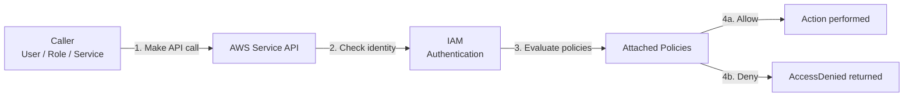
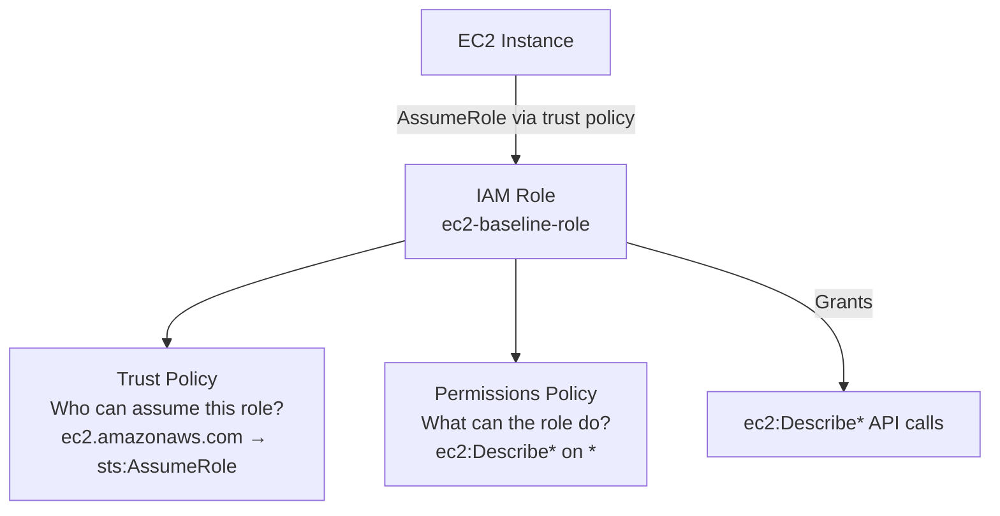
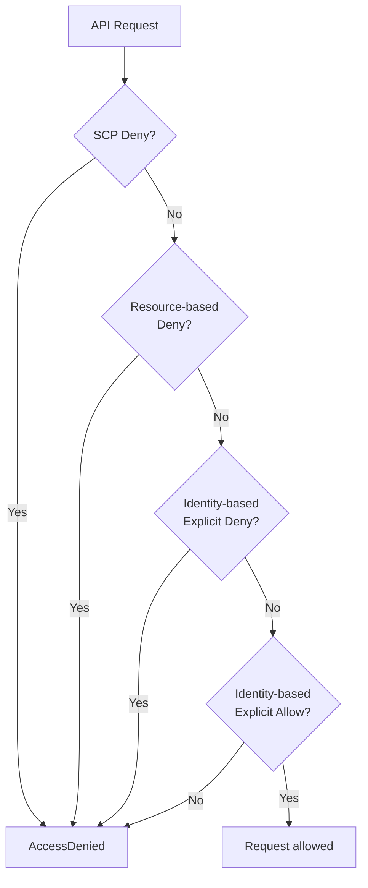
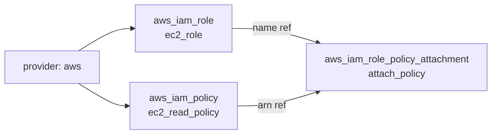
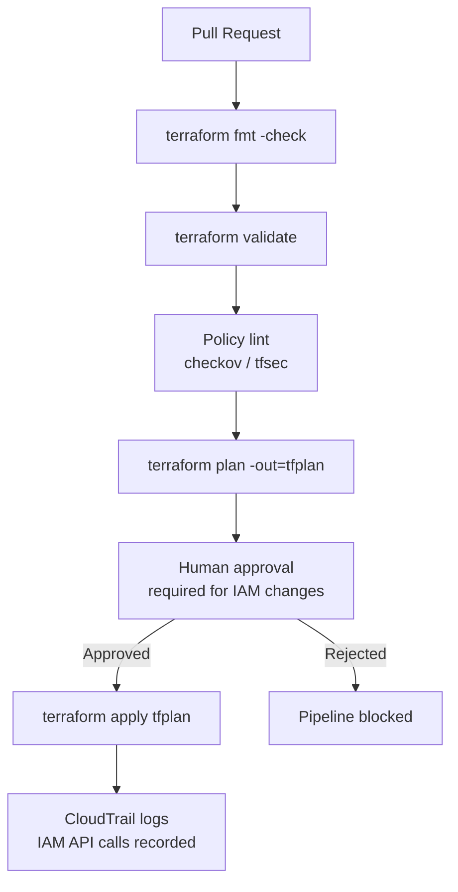

# Interview Questions — IAM Role Baseline

DevOps-level interview questions covering the concepts demonstrated in this project. Questions are grouped by topic and progress from foundational to advanced.

---

## Foundational IAM Concepts

**Q1. What is AWS IAM and what problem does it solve?**

AWS Identity and Access Management (IAM) is the service that controls who can authenticate to AWS (identity) and what actions they are authorised to perform (permissions). Without IAM, every caller would either have full account access or no access at all. IAM introduces granular control: you define identities (users, roles, groups), attach permission policies to them, and AWS evaluates those policies on every API call. It is the foundational security layer that every other AWS service depends on.



---

**Q2. What is the difference between authentication and authorisation in IAM?**

Authentication proves who the caller is — verified by AWS using access keys, STS tokens, or signed requests. Authorisation determines what the authenticated caller is allowed to do — evaluated by IAM against the set of policies attached to that principal. Both must succeed for an API call to proceed. A valid identity with no matching permission policy still results in an `AccessDenied` response.

---

**Q3. What is an IAM principal?**

A principal is an entity that can make requests to AWS. IAM recognises four principal types:

| Principal Type | Description | Example |
|---|---|---|
| IAM user | Long-term identity with static credentials | Developer account |
| IAM role | Temporary identity assumed by a service or user | EC2 instance role, Lambda execution role |
| IAM group | Collection of users sharing the same policies | `developers` group |
| AWS service | Built-in service principal that can assume a role | `ec2.amazonaws.com`, `lambda.amazonaws.com` |

In this module, `ec2.amazonaws.com` is the principal that trusts the `ec2-baseline-role`. Any EC2 instance with this role attached can call AWS APIs using the role's permissions.

---

**Q4. What is an IAM policy and what does it contain?**

An IAM policy is a JSON document that defines a set of permission statements. Each statement contains:

- **Effect** — `Allow` or `Deny`
- **Action** — one or more AWS API operations (e.g., `ec2:DescribeInstances`)
- **Resource** — the ARN(s) the action applies to
- **Condition** (optional) — constraints on when the statement applies

Policies have no effect on their own — they must be attached to a principal (user, role, or group) to take effect. In this module, the `ec2-read-only-policy` permits `ec2:Describe*` on all resources (`*`) and is attached to the `ec2-baseline-role`.

---

## IAM Service Deep Dive

**Q5. What is the difference between an IAM user, an IAM role, and an IAM group?**

| Concept | Identity Type | Credentials | Common Use |
|---|---|---|---|
| IAM user | Person or machine | Long-term access keys | Human admin, CI service account |
| IAM role | Assumable identity | Short-term STS tokens (auto-rotated) | EC2 instances, Lambda, cross-account access |
| IAM group | Collection of users | Inherits from members | Apply the same policies to a team |

Roles are preferred over users for machine identities because their credentials are automatically rotated and are never stored on the instance — they are delivered via the EC2 metadata endpoint.

---

**Q6. What is an IAM role trust policy and how does it differ from a permissions policy?**

A role has two distinct policy documents:

- **Trust policy (assume role policy):** Defines *who* can assume the role. It lists the trusted principals — services (`ec2.amazonaws.com`), other AWS accounts, or specific IAM users — and the conditions under which the assumption is allowed. In this module, the trust policy allows `ec2.amazonaws.com` to call `sts:AssumeRole`.
- **Permissions policy:** Defines *what* the role can do once assumed. It lists the API actions permitted and the resources they apply to. In this module, the permissions policy allows `ec2:Describe*` on `*`.

Both are required. A trust policy without a permissions policy creates a role that can be assumed but does nothing. A permissions policy without a trust policy cannot be assumed by anyone.



---

**Q7. What is `sts:AssumeRole` and how does the role assumption flow work?**

`sts:AssumeRole` is the AWS Security Token Service API call that exchanges a principal's identity for a set of temporary credentials scoped to the target role. The flow works as follows:

1. The caller (EC2 instance profile, a user, or another role) calls `sts:AssumeRole` with the target role ARN.
2. STS evaluates the target role's trust policy to confirm the caller is a permitted principal.
3. If allowed, STS returns three temporary values: `AccessKeyId`, `SecretAccessKey`, and `SessionToken`.
4. The caller uses these credentials to make API calls within the permissions defined by the role.
5. Credentials expire (default 1 hour for EC2 instance profiles) and are automatically rotated.

For EC2 instance profiles, step 1 is performed transparently by the EC2 metadata service — the instance fetches credentials from `169.254.169.254` without any application code.

---

**Q8. What is an IAM instance profile and why is it needed for EC2?**

An IAM instance profile is the container that attaches an IAM role to an EC2 instance. The EC2 service does not accept a role ARN directly — it requires an instance profile resource (which wraps the role). The profile is attached at launch time or dynamically via the `iam:PassRole` and `ec2:AssociateIamInstanceProfile` operations.

Once attached, the EC2 metadata endpoint provides rotating short-term credentials to any process running on the instance. Applications use the AWS SDK, which automatically queries `169.254.169.254` to obtain these credentials. No access keys are stored on the instance.

> Note: In this module, `aws_iam_instance_profile` is not yet created. The role exists but cannot be attached to an EC2 instance until a profile is provisioned.

---

**Q9. What is the difference between an inline policy and a managed policy?**

| Type | Scope | Reuse | Lifecycle |
|---|---|---|---|
| Inline policy | Embedded in one principal | Cannot be shared | Deleted when the principal is deleted |
| AWS managed policy | AWS account + other accounts | Reusable | Managed by AWS or the account owner |
| Customer-managed policy | AWS account | Reusable across roles | Independent lifecycle — survives role deletion |

This module uses a customer-managed policy (`aws_iam_policy`) rather than an inline policy (`aws_iam_role_policy`) because it can be reused across multiple roles, has a standalone ARN that can be referenced by other modules, and has a lifecycle independent from the role.

---

**Q10. What is the difference between a customer-managed policy and an AWS-managed policy?**

Customer-managed policies are created and maintained in your account. Their exact permissions are fully visible in your Terraform source and in the AWS console. You control every action listed.

AWS-managed policies (e.g., `AmazonEC2ReadOnlyAccess`) are maintained by AWS. Their permissions can be expanded at any time without your knowledge. While they are convenient for standard use cases, they introduce the risk of silent permission drift — a new EC2 API action added by AWS to `AmazonEC2ReadOnlyAccess` automatically becomes available to any role that uses it.

For security-sensitive platforms, customer-managed policies are preferred because they enforce an explicit, auditable permission set.

---

**Q11. How does IAM policy evaluation work when multiple policies are attached?**

IAM uses an explicit deny/allow evaluation model:

1. **Default deny:** All requests are denied unless an explicit `Allow` is found.
2. **Explicit deny wins:** If any policy attached to the principal contains an explicit `Deny` for the action and resource, it overrides all `Allow` statements from any source.
3. **Allow must be explicit:** A request is allowed only if at least one policy contains an `Allow` for the action, resource, and condition — and no policy contains an explicit `Deny`.



---

## Terraform Patterns

**Q12. How is an IAM role declared in Terraform and what are the required attributes?**

An `aws_iam_role` requires only two attributes — `name` and `assume_role_policy`. The assume role policy is a JSON string that defines the trust relationship. In this module, `jsonencode` generates the JSON from a native HCL map:

```hcl
resource "aws_iam_role" "ec2_role" {
  name = var.role_name

  assume_role_policy = jsonencode({
    Version = "2012-10-17"
    Statement = [
      {
        Effect    = "Allow"
        Principal = { Service = "ec2.amazonaws.com" }
        Action    = "sts:AssumeRole"
      }
    ]
  })
}
```

The role ARN (`aws_iam_role.ec2_role.arn`) and name (`aws_iam_role.ec2_role.name`) are available as output attributes after creation.

---

**Q13. What is the difference between `aws_iam_role_policy_attachment` and `aws_iam_role_policy`?**

| Resource | Attaches | Policy lifecycle | Reuse |
|---|---|---|---|
| `aws_iam_role_policy_attachment` | An existing managed policy (customer or AWS) to a role | Independent | Policy can be attached to multiple roles |
| `aws_iam_role_policy` | An inline policy defined inside the resource block | Tied to the role | Policy exists only on this one role |

This module uses `aws_iam_role_policy_attachment` because the policy (`aws_iam_policy.ec2_read_policy`) is a standalone managed resource with its own ARN. The attachment resource acts as the binding between the two — destroying the attachment detaches the policy but leaves both the role and policy intact.

---

**Q14. What implicit dependencies does Terraform resolve in this module?**

Terraform builds a dependency graph based on attribute references. In this module:

- `aws_iam_role_policy_attachment` references `aws_iam_role.ec2_role.name` and `aws_iam_policy.ec2_read_policy.arn`.
- Terraform infers that both the role and the policy must exist before the attachment can be created.
- On destroy, the order reverses: Terraform destroys the attachment first, then the role and policy in parallel.

No explicit `depends_on` is needed because the references establish the dependency chain automatically.



---

**Q15. Why is `jsonencode` preferred over an external JSON file for inline policies in this module?**

`jsonencode` validates the HCL map structure at plan time, so malformed policy JSON is caught before any AWS API call is made. A `file("policy.json")` reference is read as a raw string — JSON parsing errors only surface at apply time when AWS rejects the malformed document with a `MalformedPolicyDocument` error.

Additionally, `jsonencode` supports native HCL variable interpolation. The trust policy principal (`ec2.amazonaws.com`) could be made a variable without additional string template syntax. A raw JSON file has no equivalent mechanism.

---

## Security

**Q16. What is the principle of least privilege and how does it apply to IAM roles?**

Least privilege means granting only the minimum permissions required to perform a task and no more. For IAM roles this means:

- Specifying exact actions (`ec2:DescribeInstances`) rather than wildcards (`ec2:*` or `*:*`)
- Scoping the resource to the minimum necessary ARN (specific bucket ARN, specific parameter path)
- Adding condition keys to restrict by region, source VPC, or resource tags where the API supports them
- Reviewing attached policies periodically with IAM Access Analyzer to identify unused permissions

The `ec2:Describe*` scope in this module is a reasonable read-only baseline, but it still grants access to all EC2 resource metadata in the account. In a multi-tenant or high-compliance environment, resource tagging conditions should be added to restrict visibility to owned resources only.

---

**Q17. What is IAM Access Analyzer and how does it help with least privilege?**

IAM Access Analyzer is an AWS service that continuously analyses resource-based policies and IAM roles to identify:

- External access — roles or resources accessible from outside the account or AWS organisation
- Unused permissions — IAM actions granted to a principal that have not been used within the analysis window (typically 90 days)
- Policy validation — linting and correctness checking of policy documents against IAM best practices

For this module, Access Analyzer can flag that `ec2:Describe*` is granted on `Resource: *` and suggest scoping it with condition keys. It can also confirm that the role's trust policy is not inadvertently accessible from outside the account.

---

**Q18. What are IAM permission boundaries and when would you use them?**

A permission boundary is an IAM managed policy attached to a principal that sets the maximum permissions the principal can have — regardless of what identity-based policies are attached. It acts as a ceiling.

For example, if a permission boundary allows only `ec2:*` and `s3:*`, then even if an identity-based policy grants `iam:*`, the principal cannot perform IAM operations.

Permission boundaries are used when:
- A team needs to create IAM roles for their services but should not be able to grant themselves more than their own permissions (privilege escalation prevention)
- A platform team delegates IAM administration to a development team with guardrails on the maximum scope they can grant

---

**Q19. What is an AWS Organizations Service Control Policy (SCP) and how does it relate to IAM?**

An SCP is a policy attached at the AWS Organization or OU level that sets the maximum permissions available to all principals in member accounts. SCPs are evaluated before IAM policies — if an SCP denies an action, no IAM policy in the account can override it.

Unlike IAM policies which apply to specific identities, SCPs apply to every principal in the account, including the root user (for most service actions).

In practice, SCPs enforce organisation-wide guardrails:
- Prevent disabling CloudTrail or GuardDuty
- Restrict resource creation to approved regions
- Require encryption tags on S3 buckets and EBS volumes

The `ec2-read-only-policy` in this module would be further constrained by any SCP restricting the account to specific EC2 operations or regions.

---

**Q20. What is IAM role chaining and what are its limitations?**

Role chaining occurs when a role assumes a second role. For example: a user assumes Role A, then Role A assumes Role B. This is valid but has one important constraint — the maximum session duration for a chained session is 1 hour, regardless of the duration configured on either role. This catches engineers off guard in CI/CD pipelines that run longer than an hour via chained role assumptions.

For long-running pipelines, the preferred pattern is for the pipeline runner to assume the target role directly rather than chaining through an intermediate role.

---

## Production Readiness

**Q21. What would you change to make this IAM configuration production-ready?**

- **IAM instance profile:** Add `aws_iam_instance_profile` to allow the role to be attached to EC2 instances — without it, the role cannot be used by EC2.
- **Permission boundaries:** Attach a permission boundary to the role to enforce a maximum scope and prevent privilege escalation if the role is later given broader policies.
- **Resource-level scoping:** Replace `Resource: *` with specific ARNs or tag conditions (`ec2:ResourceTag/Environment = prod`) for any write policies added to this role in future.
- **Tagging:** Add `Environment`, `Project`, and `ManagedBy` tags to the role and policy for cost allocation and policy targeting.
- **Remote state:** Migrate `terraform.tfstate` to an S3 + DynamoDB backend for team workflows and concurrent apply protection.
- **Separate role per service:** Create dedicated roles per workload (one for EC2 instances, one for Lambda, one for ECS tasks) rather than sharing a single baseline role.

---

**Q22. How would you manage IAM roles across multiple environments (dev, staging, prod)?**

Two approaches:

1. **Separate state files with `tfvars`:** Use one Terraform configuration with `dev.tfvars`, `staging.tfvars`, `prod.tfvars` containing environment-specific names (`role_name = "dev-ec2-role"`). Each environment is initialised against a separate S3 backend prefix. This is explicit and easy to audit.

2. **Module instantiation:** Extract the IAM resources into a reusable module called from separate root configurations per environment. Each environment root configuration passes different variable values and uses a separate state backend.

For IAM specifically, all environments share the same global IAM namespace, so naming conventions (`{env}-{service}-role`) are critical to avoid collision across environments in the same account. Using separate AWS accounts per environment (the AWS-recommended model) eliminates this problem entirely — roles in dev and prod accounts are completely isolated.

---

**Q23. What is `iam:PassRole` and when is it required?**

`iam:PassRole` is the IAM permission that allows a principal to assign an IAM role to an AWS service (e.g., attach a role to an EC2 instance or a Lambda function). It is not automatically granted even if you have `ec2:RunInstances` — you also need `iam:PassRole` on the role ARN you want to attach.

This permission is intentionally separate to prevent privilege escalation: without it, a user with `ec2:RunInstances` could launch an instance with an admin role they should not have access to. By requiring `iam:PassRole`, AWS forces the explicit grant of permission to delegate a role.

In this module, the developer running `terraform apply` needs `iam:PassRole` on the `ec2-baseline-role` ARN if they later attach it to an EC2 instance.

---

## DevOps and Platform Engineering

**Q24. How would you integrate IAM role provisioning into a CI/CD pipeline?**

A typical pipeline for IAM changes requires extra caution because permissions are security-critical:

1. **PR trigger:** `terraform fmt -check` and `terraform validate` on every pull request
2. **Policy linting:** `aws cloudformation validate-template` or `checkov` / `tfsec` to catch overly permissive policies
3. **Plan stage:** `terraform plan -out=tfplan` — plan artefact saved and published for review
4. **Approval gate:** Mandatory human approval for any IAM change — never auto-apply IAM without review
5. **Apply stage:** `terraform apply tfplan`
6. **Audit trail:** Every apply is logged in CloudTrail under the pipeline's IAM role ARN



---

**Q25. What is AWS CloudTrail and why is it essential for IAM?**

AWS CloudTrail records every API call made in an AWS account — including who made the call (the IAM principal), what was called, when, from where (IP address and user agent), and whether it succeeded. For IAM, CloudTrail is the primary audit log for:

- Who created or modified roles and policies
- When `sts:AssumeRole` was called and which principal assumed which role
- `AccessDenied` events that may indicate a misconfigured permission or an attempted privilege escalation

CloudTrail logs are stored in S3 and can be queried via Athena. In a production security platform, IAM `AccessDenied` events are streamed to CloudWatch and trigger alerts. Any `CreateRole` or `AttachRolePolicy` event outside of the approved pipeline role ARN should trigger an investigation.

---

**Q26. What is IAM drift and how do you detect and respond to it?**

IAM drift occurs when the actual state of a role, policy, or attachment in AWS diverges from what is recorded in Terraform state. Common causes include:

- Manual changes made in the AWS console or via the CLI
- Another pipeline or team member modifying the same role
- An automated process (e.g., AWS Config remediation) altering a policy document

Detection and response:

```bash
# Detect drift — refresh state against live AWS and show the diff
terraform plan -refresh-only

# Correct drift — revert the live resource to match the Terraform configuration
terraform apply
```

For automated drift detection, schedule `terraform plan` in a CI pipeline and alert when the output contains changes. Pair this with AWS Config rules that flag IAM roles without required tags or policies deviating from approved templates.

---

**Q27. What is the AWS Shared Responsibility Model as it applies to IAM?**

The Shared Responsibility Model defines what AWS is responsible for versus what the customer is responsible for:

| Layer | AWS Responsible | Customer Responsible |
|---|---|---|
| Physical infrastructure | Data centres, hardware, networking | — |
| IAM service availability | IAM API uptime, STS availability | — |
| Default deny | Starting state is deny-all | Explicit allows must be configured by customer |
| IAM user/role management | — | Creating, rotating, and auditing all principals |
| Policy correctness | — | Ensuring policies enforce least privilege |
| CloudTrail enablement | — | Enabling CloudTrail and retaining logs |
| MFA enforcement | — | Enforcing MFA for privileged users via policy conditions |

AWS guarantees the IAM service works correctly. The customer is fully responsible for what permissions are granted and to whom.
